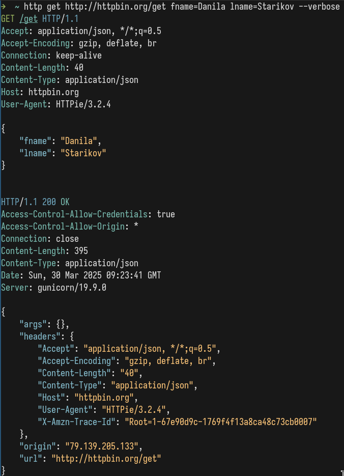
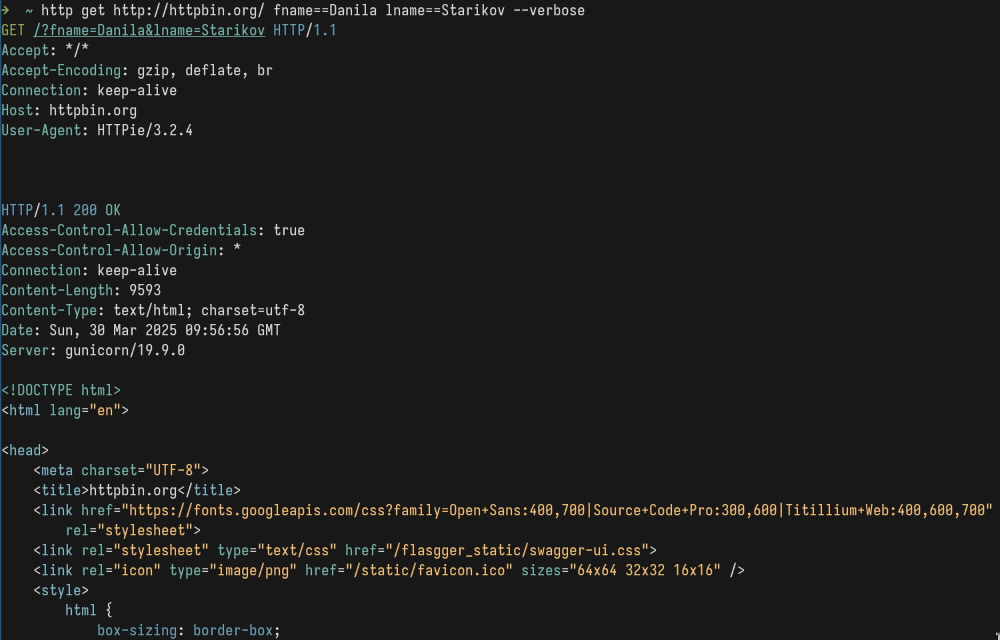
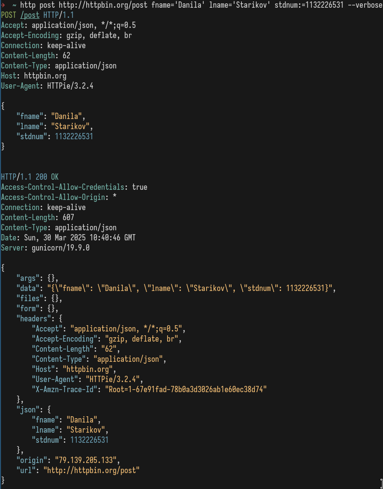
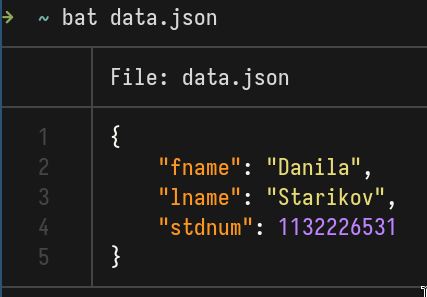
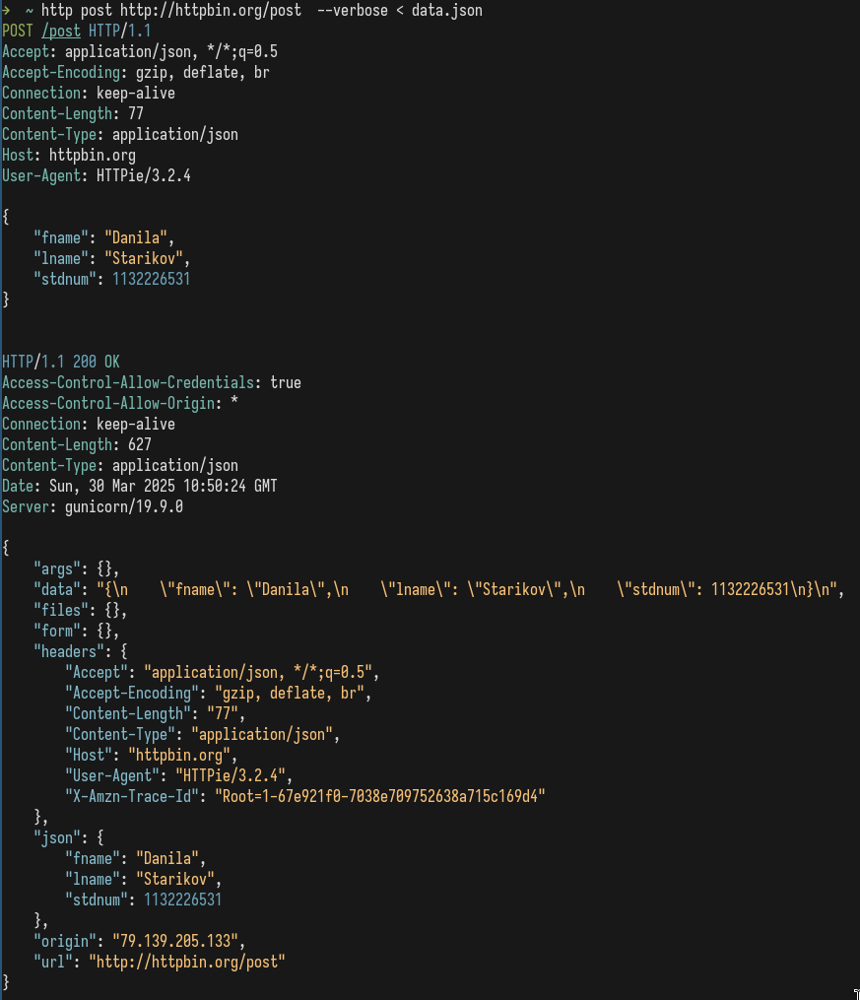

---
## Front matter
title: "Отчет по лабораторной работе №1"
author: "Данила Андреевич Стариков"

## Generic otions
lang: ru-RU
toc-title: "Содержание"


## Pdf output format
toc: true # Table of contents
toc-depth: 2
lof: false # List of figures
lot: false # List of tables
fontsize: 12pt
linestretch: 1.5
papersize: a4
documentclass: scrreprt
## I18n polyglossia
polyglossia-lang:
  name: russian
  options:
	- spelling=modern
	- babelshorthands=true
polyglossia-otherlangs:
  name: english
## I18n babel
babel-lang: russian
babel-otherlangs: english
## Fonts
mainfont: IBM Plex Serif
romanfont: IBM Plex Serif
sansfont: IBM Plex Sans
monofont: IBM Plex Mono
mathfont: STIX Two Math
mainfontoptions: Ligatures=Common,Ligatures=TeX,Scale=0.94
romanfontoptions: Ligatures=Common,Ligatures=TeX,Scale=0.94
sansfontoptions: Ligatures=Common,Ligatures=TeX,Scale=MatchLowercase,Scale=0.94
monofontoptions: Scale=MatchLowercase,Scale=0.94,FakeStretch=0.9
mathfontoptions:
## Biblatex
biblatex: true
biblio-style: "gost-numeric"
biblatexoptions:
  - parentracker=true
  - backend=biber
  - hyperref=auto
  - language=auto
  - autolang=other*
  - citestyle=gost-numeric
## Pandoc-crossref LaTeX customization
figureTitle: "Рис."
tableTitle: "Таблица"
listingTitle: "Листинг"
lofTitle: "Список иллюстраций"
lotTitle: "Список таблиц"
lolTitle: "Листинги"
## Misc options
indent: true
header-includes:
  - \usepackage{indentfirst}
  - \usepackage{float} # keep figures where there are in the text
  - \floatplacement{figure}{H} # keep figures where there are in the text
  - \usepackage{fvextra}
  - \DefineVerbatimEnvironment{Highlighting}{Verbatim}{breaklines,commandchars=\\\{\}}
---

# Цель работы

Научиться составлять HTTP-запросы типа GET и POST, используя сервис <http://httpbin.org>.


# Выполнение лабораторной работы

1. Составление HTTP-запросов будем проводить с помощью консольной утилиты [HTTPie](https://httpie.org/) к сервису <http://httpbin.org>.

2. Сформировали GET запросу к сервису  <http://httpbin.org>, передав два параметра:

	* `fname=Danila` - имя, записанное латиницей;
	* `lname=Starikov` - фамилия, также записанная латиницей.

   Запрос с помощью утилиты `HTTPie` выглядит так: 
   ```bash
   http get http://httpbin.org/get fname==Danila lname==Starikov --verbose
   ``` 
   
   Ключ `--verbose` позволит посмотреть содержимое отправляемого HTTP-запроса.

   Ответ содержит следующий текст (рис. [-@fig:01]):

	* Содержимое HTTP запроса:

```
GET /get?fname=Danila&lname=Starikov HTTP/1.1
Accept: */*
Accept-Encoding: gzip, deflate, br
Connection: keep-alive
Host: httpbin.org
User-Agent: HTTPie/3.2.4
```
	* Ответ сервера:

```
HTTP/1.1 200 OK
Access-Control-Allow-Credentials: true
Access-Control-Allow-Origin: *
Connection: keep-alive
Content-Length: 380
Content-Type: application/json
Date: Sun, 30 Mar 2025 09:41:33 GMT
Server: gunicorn/19.9.0

{
    "args": {
        "fname": "Danila",
        "lname": "Starikov"
    },
    "headers": {
        "Accept": "*/*",
        "Accept-Encoding": "gzip, deflate, br",
        "Host": "httpbin.org",
        "User-Agent": "HTTPie/3.2.4",
        "X-Amzn-Trace-Id": "Root=1-67e911cd-0b9aaa234e2d13756df3f2bd"
    },
    "origin": "79.139.205.133",
    "url": "http://httpbin.org/get?fname=Danila&lname=Starikov"
}
```
   
{#fig:01 width=70%}

Отправленный и полученный HTTP-запросы отличаются: параметры передавались изменением `URL`-строки (`HTTPie` делает это автоматически), а сервер правильно их считал и вернул уже как поле `args` в `json`-объекте, наряду с полной заголовочной информацией и полученном HTTP-запросе.

3. По какому адресу нужно совершить GET запрос, чтобы httpbin его корректно обработал?

`GET` запрос совершается по адресу `http://httpbin.org/get`, например:

```bash
http get http://httpbin.org/get fname==Danila lname==Starikov --verbose
```

Если указать только адрес `http://httpbin.org`, то ответом на запрос будет `HTML` код, предназначенный для просмотра в браузере (рис. [-@fig:02]).

{#fig:02 width=70%}

4. Отобразите заголовок HTTP ответа, который прислал вам сервер. Объясните назначение каж
дого из полей данного заголовка.

Заголовок HTTP ответа:

```
HTTP/1.1 200 OK
Access-Control-Allow-Credentials: true
Access-Control-Allow-Origin: *
Connection: keep-alive
Content-Length: 380
Content-Type: application/json
Date: Sun, 30 Mar 2025 09:41:33 GMT
Server: gunicorn/19.9.0
```

  * `HTTP/1.1 200 OK` : статус 200 означает, что запрос успешно выполнен
  * `Access-Control-Allow-Credentials: true` : сервер разрешает отправку учетных данных (`credentials`, например куки) вместе с запросами из других источников (доменов)
  * `Access-Control-Allow-Origin: *` : описывает источники, с которых сервер принимает запросы. `'*'` указывает, что сервер принимает запросы с любых источников
  * `Connection: keep-alive` : оставлять соединение после завершения текущего запроса. Так, последующие запросы будут обработаны быстрее
  * `Content-Length: 380` : указывает длину тела ответа в байтах 
  * `Content-Type: application/json` : указывает типа содержимого, здесь - `json` объект
  * `Date: Sun, 30 Mar 2025 09:41:33 GMT` : Дата и время генерации ответа
  * `Server: gunicorn/19.9.0` : ПО, используемое сервером

5. В какой части HTTP сообщения были отправлены параметры fname и lname?

Параметра `fname`  и `lname` переданы через саму `URL` строку:
```
GET /get?fname=Danila&lname=Starikov HTTP/1.1p
```
Если не пользоваться возможностями утилиты `HTTPie`, то адрес выглядел бы как
```
http://httpbin.org/get?fname=Danila&lname=Starikov
```

6. Теперь отправьте на сервер POST запрос, передав параметры fname, lname и stdnum, где
stdnum — номер вашего студенческого билета. Необходимо, чтобы сервер воспринял эти па
раметры как поля веб-формы.

`POST` запрос отправим следующей командой (рис. [-@fig:03]):
```bash
http post http://httpbin.org/post fname="Danila" lname="Starikov" stdnum:=1132226531 --verbose
```
Здесь использован один символ `=` вместо двух, а сами значения имени и фамилии заключены в кавычки, чтобы подсказать утилите
составить веб-форму из переданных параметров. Для корректной передачи номер билета как целого числа использовали оператор `:=`. Отправленный HTTP запрос выглядит следующим образом:

{#fig:03 width=70%}

7. Отобразите содержимое HTTP запроса (первую строку, заголовок и тело). Какое поле заголовка HTTP сообщения указывает, что переданные данные являются полями веб-формы?

Отправленный HTTP запрос выглядит так:

```
POST /post HTTP/1.1
Accept: application/json, */*;q=0.5
Accept-Encoding: gzip, deflate, br
Connection: keep-alive
Content-Length: 62
Content-Type: application/json
Host: httpbin.org
User-Agent: HTTPie/3.2.4

{
    "fname": "Danila",
    "lname": "Starikov",
    "stdnum": 1132226531
}
```

Поле `Content-Type: application/json` указывает, что переданные данные это веб-форма. 

8. По какому адресу вы отправили запрос?

Запрос передан по адресу `http://httpbin.org/post`

9. В какой части HTTP сообщения содержатся пересылаемые параметры?

Пересылаемые параметры расположены после заголовка и отображается в виде `json` объекта:

```
{
    "fname": "Danila",
    "lname": "Starikov",
    "stdnum": 1132226531
}
```

10. Перешлите те же параметры в виде JSON документа. Какие поля нужно установить в заголовке HTTP сообщения, чтобы сервер воспринял передаваемое сообщение как JSON-документ?

Создали файл data.json, в котором хранится сообщение (рис. [-@fig:04]):

```json
{
    "fname": "Danila",
    "lname": "Starikov",
    "stdnum": 1132226531
}
```
{#fig:04 width=70%}

Составили POST запрос (рис. [-@fig:05]), в который передается содержимое `data.json`: `http post http://httpbin.org/post  --verbose < data.json`. Вывод утилиты выглядит следующим образом:

```{.linebreak}
POST /post HTTP/1.1
Accept: application/json, */*;q=0.5
Accept-Encoding: gzip, deflate, br
Connection: keep-alive
Content-Length: 77
Content-Type: application/json
Host: httpbin.org
User-Agent: HTTPie/3.2.4

{
    "fname": "Danila",
    "lname": "Starikov",
    "stdnum": 1132226531
}


HTTP/1.1 200 OK
Access-Control-Allow-Credentials: true
Access-Control-Allow-Origin: *
Connection: keep-alive
Content-Length: 627
Content-Type: application/json
Date: Sun, 30 Mar 2025 10:50:24 GMT
Server: gunicorn/19.9.0

{
    "args": {},
    "data": "{\n    \"fname\": \"Danila\",\n    \"lname\": \"Starikov\",\n    \"stdnum\": 1132226531\n}\n",
    "files": {},
    "form": {},
    "headers": {
        "Accept": "application/json, */*;q=0.5",
        "Accept-Encoding": "gzip, deflate, br",
        "Content-Length": "77",
        "Content-Type": "application/json",
        "Host": "httpbin.org",
        "User-Agent": "HTTPie/3.2.4",
        "X-Amzn-Trace-Id": "Root=1-67e921f0-7038e709752638a715c169d4"
    },
    "json": {
        "fname": "Danila",
        "lname": "Starikov",
        "stdnum": 1132226531
    },
    "origin": "79.139.205.133",
    "url": "http://httpbin.org/post"
}
```

{#fig:05 width=70%}


11. В какой части HTTP сообщения передается JSON документ?

`JSON` документ передается в теле сообщения, который выводится после блока заголовков, например:
  * В отправленном запросе:
  ```json
  {
    "fname": "Danila",
    "lname": "Starikov",
    "stdnum": 1132226531
}
  ```

  * В ответе сервера:
  ```json
  {
    "args": {},
    "data": "{\n    \"fname\": \"Danila\",\n    \"lname\": \"Starikov\",\n    \"stdnum\": 1132226531\n}\n",
    "files": {},
    "form": {},
    "headers": {
        "Accept": "application/json, */*;q=0.5",
        "Accept-Encoding": "gzip, deflate, br",
        "Content-Length": "77",
        "Content-Type": "application/json",
        "Host": "httpbin.org",
        "User-Agent": "HTTPie/3.2.4",
        "X-Amzn-Trace-Id": "Root=1-67e921f0-7038e709752638a715c169d4"
    },
    "json": {
        "fname": "Danila",
        "lname": "Starikov",
        "stdnum": 1132226531
    },
    "origin": "79.139.205.133",
    "url": "http://httpbin.org/post"
  }
  ```
  
  
# Выводы

В результате выполнения лабораторной работы познакомились с механизмом отправки HTTP-запросов типа GET и POST для передачи веб-форм.
