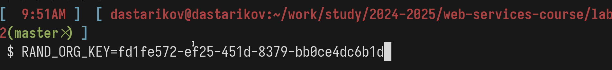
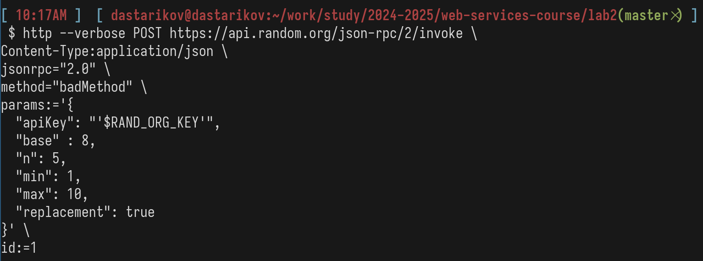
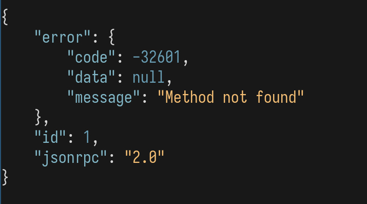
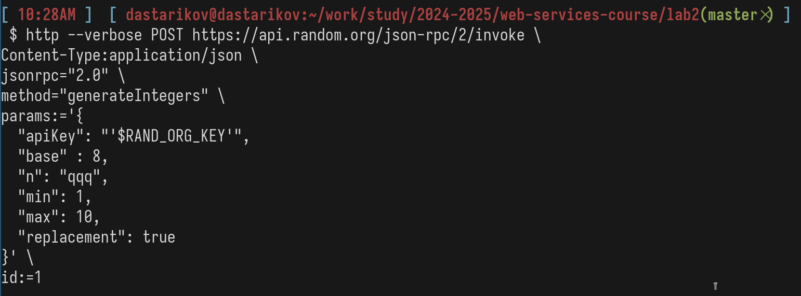
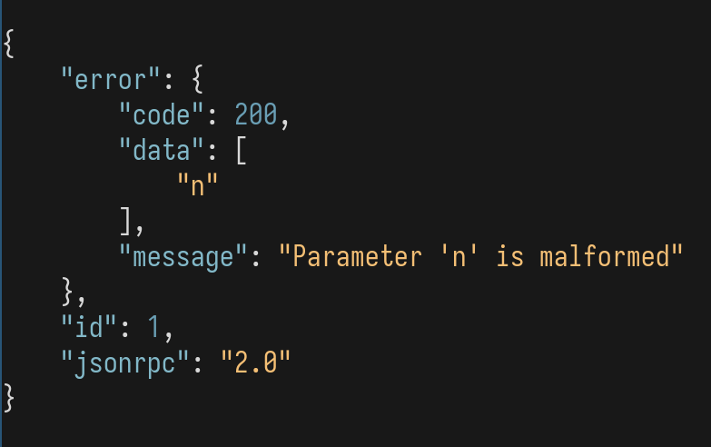
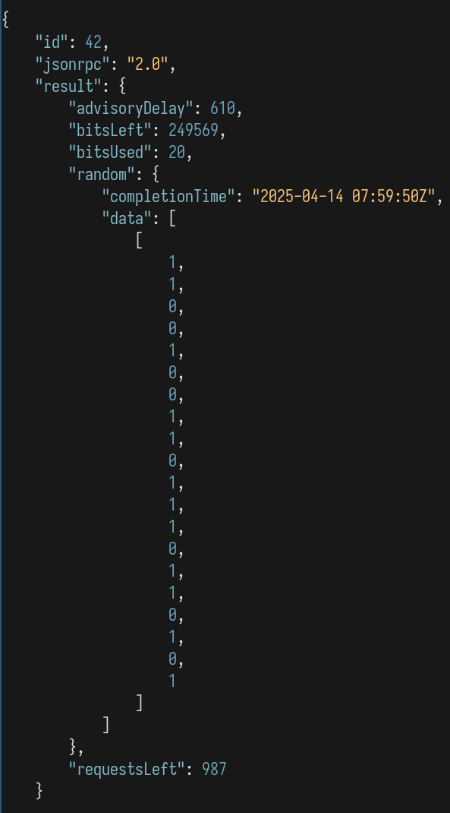
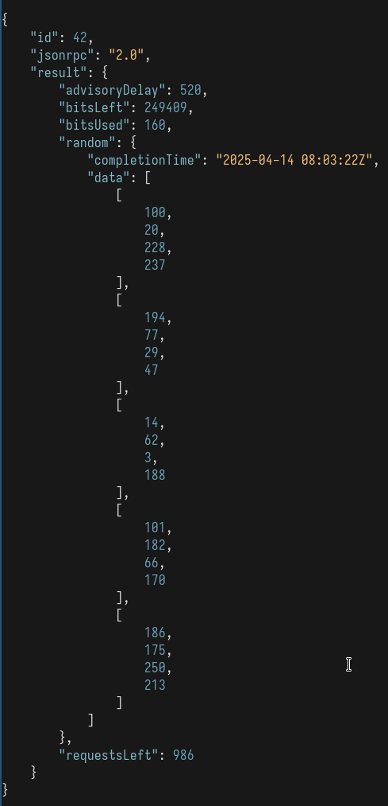

---
## Front matter
title: "Отчет по лабораторной работе №2"
author: "Данила Андреевич Стариков"

## Generic otions
lang: ru-RU
toc-title: "Содержание"


## Pdf output format
toc: true # Table of contents
toc-depth: 2
lof: false # List of figures
lot: false # List of tables
fontsize: 12pt
linestretch: 1.5
papersize: a4
documentclass: scrreprt
## I18n polyglossia
polyglossia-lang:
  name: russian
  options:
	- spelling=modern
	- babelshorthands=true
polyglossia-otherlangs:
  name: english
## I18n babel
babel-lang: russian
babel-otherlangs: english
## Fonts
mainfont: IBM Plex Serif
romanfont: IBM Plex Serif
sansfont: IBM Plex Sans
monofont: IBM Plex Mono
mathfont: STIX Two Math
mainfontoptions: Ligatures=Common,Ligatures=TeX,Scale=0.94
romanfontoptions: Ligatures=Common,Ligatures=TeX,Scale=0.94
sansfontoptions: Ligatures=Common,Ligatures=TeX,Scale=MatchLowercase,Scale=0.94
monofontoptions: Scale=MatchLowercase,Scale=0.94,FakeStretch=0.9
mathfontoptions:
## Biblatex
biblatex: true
biblio-style: "gost-numeric"
biblatexoptions:
  - parentracker=true
  - backend=biber
  - hyperref=auto
  - language=auto
  - autolang=other*
  - citestyle=gost-numeric
## Pandoc-crossref LaTeX customization
figureTitle: "Рис."
tableTitle: "Таблица"
listingTitle: "Листинг"
lofTitle: "Список иллюстраций"
lotTitle: "Список таблиц"
lolTitle: "Листинги"
## Misc options
indent: true
header-includes:
  - \usepackage{indentfirst}
  - \usepackage{float} # keep figures where there are in the text
  - \floatplacement{figure}{H} # keep figures where there are in the text
  - \usepackage{fvextra}
  - \DefineVerbatimEnvironment{Highlighting}{Verbatim}{breaklines,commandchars=\\\{\}}
---

# Цель работы

Познакомиться с протоколом JSON-PRC на примере составления запросов к сервису [](random.org).


# Выполнение лабораторной работы

*  Какие поля запроса и ответа фиксируются стандартом JSON-RPC?

При составлении запроса обязательно должны быть поля: "jsonrpc" --- версия используемого протокола JSON-RPC, "method" --- строка с указанием типа вызываемого метода, "params" --- массив данных, которые передаются методу, "id" --- значение любого типа, которое будет использоваться для идентификации ответа сервера.

При составлении ответа обязатетльно должны быть поля: "jsonrpc" --- версия используемого протокола JSON-RPC, "result" --- возвращаемые методом данные (`null` если при работе метода произошла ошибка , "error" --- код ошибки (должен быть только при наличии ошибки), "id" --- то же значение, что и в соответствующем запросе.

*  Сохраняли ли вы ключ в переменную для дальнейшего использования или каждый раз
вставляли в тело запроса?

Создана переменная окружения для API ключа, далее в теле запроса указывалось только имя этой переменной:

{#fig:01 width=70%}

*  Сформируйте и выполните запрос к методу `generateIntegers` используя только обязательные параметры. Запросите 5 случайных чисел. Диапазон чисел выбирайте сами.

Выбран диапазон чисел от 1 до 10, запрос выглядит следующим образом:

```
 $ http POST https://api.random.org/json-rpc/2/invoke \
Content-Type:application/json \
jsonrpc="2.0" \
method="generateIntegers" \
params:='{
  "apiKey": "'$RAND_ORG_KEY'",
  "n": 5,
  "min": 1,
  "max": 10,
  "replacement": true
}' \
id:=1
```

Тело ответа выглядит так:
```json
{

    "id": 1,
    "jsonrpc": "2.0",
    "result": {
        "advisoryDelay": 520,
        "bitsLeft": 249932,
        "bitsUsed": 17,
        "random": {
            "completionTime": "2025-04-14 06:55:51Z",
            "data": [
                10,
                6,
                10,
                3,
                2
            ]
        },
        "requestsLeft": 996
    }
}
```

{#fig:02 width=70%}

{#fig:03 width=70%}

*  Какие поля в заголовке HTTP-запроса вы установили (отобразите заголовок вашего запроса)?

{#fig:04 width=70%}

*  Каким HTTP-методом осуществляются запросы к random.org?

Запросы к random.org осуществляюется с помощью метода `POST`.

*  Отобразите тело ответа, который прислал сервер. Поясните все его поля.

В теле ответа содержатся поля:

  * `"id": 1` --- идентфикатор, совпадающий с `id`, указанным при запросе
  * `"jsonrpc": "2.0"` --- версия протокола JSON-RPC
  * `result` --- поле с данными, относящимися к ответу на запрос:
    * `"advisoryDelay": 930` --- рекомендуемая задержка перед отправкой следующего запроса (в мс)
    * `"bitsLeft": 249864` --- оставшееся количество битов для бесплатного пользования сервисом
    * `"bitsUsed": 17` --- количество битов использованное для выполнения этого запроса
    * `"random"` --- поле, содержащее случайные данные (`"data"`) и время выполнения запроса (`"completionTime"`)
  * `"requestsLeft"` --- количество оставшихся запросов для бесплатного пользования сервисом
  
{#fig:03_1 width=70%}

*  Отобразите поля заголовка HTTP-ответа.

{#fig:05 width=70%}

*  Сформируйте запрос на 5 чисел в восьмеричной системе счисления. Какого типа данные
будут в поле data ответа сервера? Под типом подразумеваются тип поддерживаемый
форматом JSON.

{#fig:06 width=70%}

{#fig:07 width=70%}

Заметим, что теперь массив `"data"` хранит данные в виде строк, причем на первом месте всегда стоит ноль.

*  Как вы думаете, зачем нужен параметр advisoryDelay в ответе от сервера? Чему он
равен в вашем случае? Менялся ли он от запроса к запросу?

    * `"advisoryDelay"` --- рекомендуемая задержка перед отправкой следующего запроса (в мс). В ходе работы меняется, например: 900, 930, 730.
	
*  Изучите список ошибок, которые обрабатывает сервер. Сформируйте два запроса, которые вызовут две разные ошибки на ваш выбор.

	* Ошибка `-32601 Method not found`:
	
{#fig:08 width=70%}

{#fig:09 width=70%}
	
   * Ошибка `200 Parameter is malformed`:
	
{#fig:10 width=70%}

{#fig:11 width=70%}
	

*  Теперь сформируйте и отправьте запрос к методу generateIntegerSequences.

Сгенерировали один массив чисел от 1 до 30 длиной 20:

{#fig:12 width=70%}

{#fig:13 width=70%}

*  Покажите подробно исходный код вашего запроса, и исходный код ответа от сервера.
Появились ли какие-то новые поля заголовка HTTP-сообщения?

```bash
http --verbose POST https://api.random.org/json-rpc/2/invoke \
Content-Type:application/json \
jsonrpc="2.0" \
method="generateIntegerSequences" \
params:='{
  "apiKey": "'$RAND_ORG_KEY'",
  "base" : 10,
  "n": 1,
  "length" : 20,
  "min": 1,
  "max": 30,
  "replacement": true
}' \
id:=42
```

```json
{
    "id": 42,
    "jsonrpc": "2.0",
    "result": {
        "advisoryDelay": 940,
        "bitsLeft": 249609,
        "bitsUsed": 98,
        "random": {
            "completionTime": "2025-04-14 07:52:09Z",
            "data": [
                [
                    13,
                    28,
                    14,
                    16,
                    26,
                    4,
                    29,
                    13,
                    8,
                    2,
                    19,
                    15,
                    23,
                    19,
                    13,
                    28,
                    15,
                    25,
                    17,
                    2
                ]
            ]
        },
        "requestsLeft": 989
    }
}
```

Новые поля в HTTP запросе не появились.


*  В чем отличия поля random в случае метода generateIntegerSequences?

Этот метод генерирует данные в виде последовательности, поэтому элементом массива `data` тоже будет массив.

*  Как с помощью random.org просимулировать подкидывание монеты или шестигранной игральной кости (кубика)? Подумайте, какие параметры нужно указать в запросе.

Пусть 0 - ребро, 1 - решка. Тогда нужно построить запрос, генерирующий последовательность нулей и единиц:

```bash
http --verbose POST https://api.random.org/json-rpc/2/invoke \
Content-Type:application/json \
jsonrpc="2.0" \
method="generateIntegerSequences" \
params:='{
  "apiKey": "'$RAND_ORG_KEY'",
  "base" : 10,
  "n": 1,
  "length" : 20,
  "min": 0,
  "max": 1,
  "replacement": true
}' \
id:=42
```

{#fig:14 width=70%}

*  Представьте, что вам нужно сгенерировать случайные IP-адреса (5 штук). Какой запрос
нужно послать к random.org?

Один IP-адрес можно представить в виде последовательности 4 чисел, принимающих значения от 0 до 255.

```bash
http --verbose POST https://api.random.org/json-rpc/2/invoke \
Content-Type:application/json \
jsonrpc="2.0" \
method="generateIntegerSequences" \
params:='{
  "apiKey": "'$RAND_ORG_KEY'",
  "base" : 10,
  "n": 5,
  "length" : 4,
  "min": 0,
  "max": 255,
  "replacement": true
}' \
id:=42
```

```json
{
    "id": 42,
    "jsonrpc": "2.0",
    "result": {
        "advisoryDelay": 520,
        "bitsLeft": 249409,
        "bitsUsed": 160,
        "random": {
            "completionTime": "2025-04-14 08:03:22Z",
            "data": [
                [
                    100,
                    20,
                    228,
                    237
                ],
                [
                    194,
                    77,
                    29,
                    47
                ],
                [
                    14,
                    62,
                    3,
                    188
                ],
                [
                    101,
                    182,
                    66,
                    170
                ],
                [
                    186,
                    175,
                    250,
                    213
                ]
            ]
        },
        "requestsLeft": 986
    }
}
```
{#fig:15 width=70%}


*  Подумайте, зачем может понадобится `generateIntegerSequences` и почему нельзя
обойтись многократным вызовом generateIntegers?

Использование метода `generateIntegerSequences` позволяет уменьшить количество запросов к сервису, уменьшить генерации последовательностей и расходы на отправку запросов.

# Выводы

В результате выполнения лабораторной работы познакомились с протоколом JSON-RPC на примере составления запросов к сервису [](random.org)
