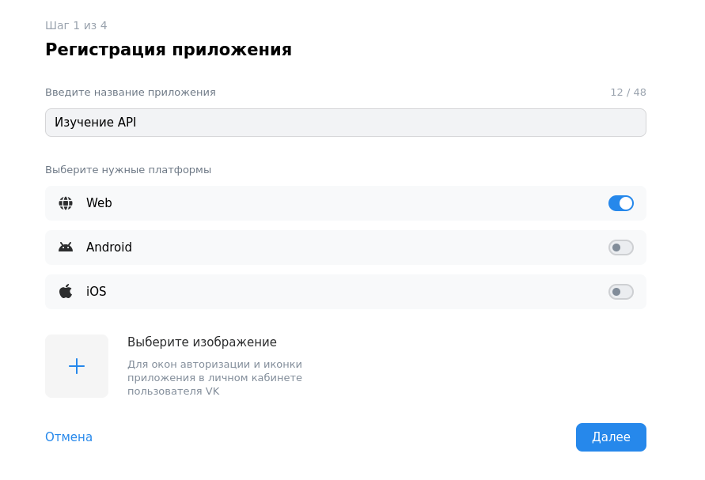
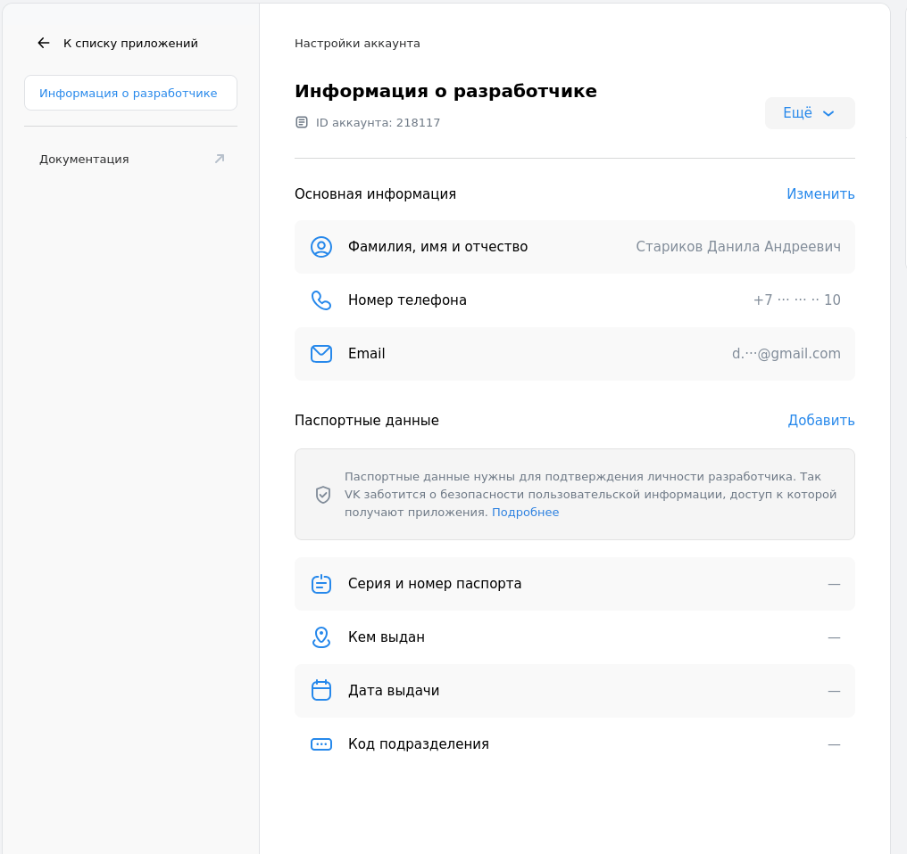

---
## Front matter
title: "Отчет по лабораторной работе №3"
author: "Данила Андреевич Стариков"

## Generic otions
lang: ru-RU
toc-title: "Содержание"


## Pdf output format
toc: true # Table of contents
toc-depth: 2
lof: false # List of figures
lot: false # List of tables
fontsize: 12pt
linestretch: 1.5
papersize: a4
documentclass: scrreprt
## I18n polyglossia
polyglossia-lang:
  name: russian
  options:
	- spelling=modern
	- babelshorthands=true
polyglossia-otherlangs:
  name: english
## I18n babel
babel-lang: russian
babel-otherlangs: english
## Fonts
mainfont: IBM Plex Serif
romanfont: IBM Plex Serif
sansfont: IBM Plex Sans
monofont: IBM Plex Mono
mathfont: STIX Two Math
mainfontoptions: Ligatures=Common,Ligatures=TeX,Scale=0.94
romanfontoptions: Ligatures=Common,Ligatures=TeX,Scale=0.94
sansfontoptions: Ligatures=Common,Ligatures=TeX,Scale=MatchLowercase,Scale=0.94
monofontoptions: Scale=MatchLowercase,Scale=0.94,FakeStretch=0.9
mathfontoptions:
## Biblatex
biblatex: true
biblio-style: "gost-numeric"
biblatexoptions:
  - parentracker=true
  - backend=biber
  - hyperref=auto
  - language=auto
  - autolang=other*
  - citestyle=gost-numeric
## Pandoc-crossref LaTeX customization
figureTitle: "Рис."
tableTitle: "Таблица"
listingTitle: "Листинг"
lofTitle: "Список иллюстраций"
lotTitle: "Список таблиц"
lolTitle: "Листинги"
## Misc options
indent: true
header-includes:

  - \usepackage{indentfirst}
  - \usepackage{float} # keep figures where there are in the text
  - \floatplacement{figure}{H} # keep figures where there are in the text
  - \usepackage{fvextra}
  - \DefineVerbatimEnvironment{Highlighting}{Verbatim}{breaklines,commandchars=\\\{\},breaknonspaceingroup,breakanywhere}
---

# Цель работы

Исследовать Web API социальной сети [Вконтакте](https://vk.com), сформировать различные запросы к нему.

# Выполнение лабораторной работы


1. Откройте страницу с [https://vk.com/dev/manuals](документацией) и прочтите раздел [https://vk.com/dev/first_guide](Знакомство с API)

	1. По какому адресу необходимо совершать запросы при обращении к API сайте?

	Запросы совершаются по адресам `api.vk.com` или `api.vk.ru`.
	
	1. Есть ли среди методов API методы, доступные без необходимости авторизации?

	Нет, все методы требуют поле `access_token`, есть несколько видов: серверный ключ доступа, ключ
	доступа пользователя, ключ доступа сообщества.

	1. 	Каким HTTP методом можно совершать запросы к API?

	Вырезка из документации: "Для отправки API-запросов используйте HTTP-метод POST или GET. В API
    ВКонтакте эти методы равнозначны."

	1. Что означает точка в названии методов (например, users.get)?

	`users` означает имя раздела, а `get` -- само имя метода. Деление методов на разделы позволяет
    ограничивать доступ приложений к данным пользователей.

	1. В каком формате сервер посылает ответы на запросы клиента?

	Ответом на запрос пользователя всегда будет JSON-объект с единственным полем `response`, в
    котором будут хранится вся информация по запросу.
	

	1. Каким образом клиент может заранее узнать о структуре ответа при запросе к тому или иному
       методу?

	Описание всех методов, как схемы для запросов, так и схемы для ответов, описаны на языке JSON Schema в репозитории
	[](https://github.com/VKCOM/vk-api-schema/tree/master). Например, ответ для метода [users.get]() (вырезка из общего файла `responses.json`):

```json
{
	"users_get_response": {
      "type": "object",
      "properties": {
        "response": {
          "type": "array",
          "items": {
            "$ref": "../users/objects.json#/definitions/users_user_full"
          },
          "required": true
        }
      }
    }
}
```
	
	1. Следуя инструкции в пункте [2. Регистрация приложения](https://vk.com/dev/first_guide?f=2.%20%D0%A0%D0%B5%D0%B3%D0%B8%D1%81%D1%82%D1%80%D0%B0%D1%86%D0%B8%D1%8F%20%D0%BF%D1%80%D0%B8%D0%BB%D0%BE%D0%B6%D0%B5%D0%BD%D0%B8%D1%8F) зарегистрируйте новое приложение, указав
        в названии «Изучение API» (или что-то в этом роде).
		
	    * Выбрали standalone-приложение, прошли регистрацию:
		
		
		
		
	
	1. Следуя инструкции в пункте [3. Авторизация пользователя](https://vk.com/dev/first_guide?f=3.%20%D0%90%D0%B2%D1%82%D0%BE%D1%80%D0%B8%D0%B7%D0%B0%D1%86%D0%B8%D1%8F%20%D0%BF%D0%BE%D0%BB%D1%8C%D0%B7%D0%BE%D0%B2%D0%B0%D1%82%D0%B5%D0%BB%D1%8F) получите токен доступа
       (access_token). Каким способом авторизации вы при этом воспользовались? На какой срок
       выдается токен? Как сделать токен бессрочным? Привязан ли токен к пользователю?

	Для авторизации пользователей через standalone-приложение нужно это приложение сделать, но для выполения лабораторной работы можно использовать ключ от самого приложения, что и сделаем.

	1. Изучите пункт [4. Права доступа](https://dev.vk.com/ru/reference/access-rights). Каким образом регулируются права доступа приложения?

	По умолчанию у приложения есть доступы только к личным данным пользователей и их почте. Для получения расширенного доступа необходимо дополнить информацию о разработчике (паспортные данные).
	
	
	
	

2. Перейдите на страницу документации с полным списком методов. Слева в меню можно выбирать группу
   методов, информацию о которой вы хотите получить.

	

3. В этом пункте изучим группу методов users, в которой есть ряд методов, доступных без регистрации
   (без токена доступа).

	1. Найдите метод, который позволяет производить поиск пользователей по произвольному запросу.
	
	Метод `users.search`.

	1. Сформируйте и отправьте запрос на поиск пользователя по имени и фамилии (можно искать любого
       человека, главное, чтобы результат выдачи был не пуст). Как упорядочены результаты поиск?

	Чтобы получить возможность отправлять запрос, необходимо иметь `Ключ доступа пользователя`, однако при создании приложения мы получаем только `Сервисный ключ доступа`. `Ключ доступа пользователя` предлагается получить через [VK Bridge](https://vk.com/app6909581), выбрав метод `GetAuthToken`. В ответ мы получим JSON-объект с полем `access_token`, который и будем использовать для формирования запросов.

	


	Теперь сформируем запрос на поиск пользователей по имени и фамилии:
	
```bash
http POST https://api.vk.com/method/users.search \
q=="Иван Иванов" \
access_token==vk1.a.BJrTJ-5411hs-4W_DRw_5yLGCwBEfwZnoZa6thD68C0WR4XzwxhznMq7Nz-nXGq0UFtS282vepn-rRQ2b9fhtWDPM1MYwrbtlDhHdEZlu_B0xObsb81hYAuh46-EBUDcI5ysu1MhL4rQvSdeChphIFcDRHqf7AHhrh0zWb7KWcS886zcg5nU93CHIgyL9_cg \
v==5.199 --verbose
```

В ответ получаем JSON-объект (ответ укорочен для читаемости):

```json
{
    "response": {
        "count": 901830,
        "items": [
            {
                "can_access_closed": false,
                "first_name": "Дмитрий",
                "id": 129747261,
                "is_closed": true,
                "last_name": "Иванов",
                "track_code": "71a034038ZDwi1-NDAwGyvar_rsRd0RQ03E7KUYYaDkaufzXMhSW-eDbBLQIDVrFw3EIe-90LF7VcjspSH4aUA"
            },
            {
                "can_access_closed": true,
                "first_name": "Илья",
                "id": 193498876,
                "is_closed": false,
                "last_name": "Иванов",
                "track_code": "222d8597Nxtn36VoOWRlbbPoswPRYVrVTsiUaqS1BXnYDsnHQ8JQcnGE_1BuazBoiD1PwihiMttIy5RqqtN3EA"
            },
            {
                "can_access_closed": false,
                "first_name": "Иван",
                "id": 200812476,
                "is_closed": true,
                "last_name": "Иванов",
                "track_code": "16c732628OvN0zRe740e1zr52j_sFOsISX6blp9dQYCcqiGIQMyXgtmCaGC4jBjWCCYq_hUXgwZPfZuWkTsz6Q"
            },
            {
                "can_access_closed": false,
                "first_name": "Иван",
                "id": 18016708,
                "is_closed": true,
                "last_name": "Иванов",
                "track_code": "a33240c7jzJkKZXm40DTCHznCOGkmXK__9KYKlVthInlA_bGzHPoWy4oxIzlHtEOTj38L23xFqLg349YWwv2"
            }
		]
    }
}
```

1.  Сократите количество результатов выдачи до 2-х.

	Модифицируем запрос, чтобы ответе было только 2 найденных пользователя:
	
```bash
http POST https://api.vk.com/method/users.search \
q=="Иван Иванов" \
count==2 \
access_token==vk1.a.BJrTJ-5411hs-4W_DRw_5yLGCwBEfwZnoZa6thD68C0WR4XzwxhznMq7Nz-nXGq0UFtS282vepn-rRQ2b9fhtWDPM1MYwrbtlDhHdEZlu_B0xObsb81hYAuh46-EBUDcI5ysu1MhL4rQvSdeChphIFcDRHqf7AHhrh0zWb7KWcS886zcg5nU93CHIgyL9_cg \
v==5.199 --verbose
```

В ответ получаем JSON-объект только с двумя пользователями:

```json
{
    "response": {
        "count": 901836,
        "items": [
            {
                "can_access_closed": false,
                "first_name": "Дмитрий",
                "id": 129747261,
                "is_closed": true,
                "last_name": "Иванов",
                "track_code": "9b8baa66UwVaGtsovU94AKOhCLx6UclIbgoB0k7RU40LRI3GNjc0bElP0BnoSXRSlnuyGohVoUZoCQHSQLch5A"
            },
            {
                "can_access_closed": true,
                "first_name": "Илья",
                "id": 193498876,
                "is_closed": false,
                "last_name": "Иванов",
                "track_code": "ec80dd21JM5R_Q4bKy3BUnC_m5gwuILD5nIBxscQZBxMXMC5t49Dp0D7X3EvdspRS2orP8W86s3gcQHGyXYWdQ"
            }
        ]
    }
}
```

1.  Какая информация о найденных пользователях отображается в ответе сервера? Задайте
        отображение нескольких дополнительных полей.

По умолчанию в ответе указывается:
	
   * "can_access_closed" -- boolean Может ли текущий пользователь видеть профиль при is_closed = 1 (например, он есть в друзьях)
   * "first_name" -- string Имя
   * "id" -- integer Идентификатор пользователя
   * "is_closed" -- boolean Скрыт ли профиль пользователя настройками приватности
   * "last_name" -- string Фамилия

Модифицируем запрос, чтобы видеть информацию о родном городе пользователя, добавив поле `fields`:

```bash
http POST https://api.vk.com/method/users.search \
q=="Иван Иванов" \
сount==5 \
fields=="city"\
access_token==vk1.a.BJrTJ-5411hs-4W_DRw_5yLGCwBEfwZnoZa6thD68C0WR4XzwxhznMq7Nz-nXGq0UFtS282vepn-rRQ2b9fhtWDPM1MYwrbtlDhHdEZlu_B0xObsb81hYAuh46-EBUDcI5ysu1MhL4rQvSdeChphIFcDRHqf7AHhrh0zWb7KWcS886zcg5nU93CHIgyL9_cg \
v==5.199 --verbose
```

В ответе появляется поле `city`, если это информация открыта:

```json
{
    "response": {
        "count": 901834,
        "items": [
            {
                "can_access_closed": false,
                "city": {
                    "id": 1,
                    "title": "Москва"
                },
                "first_name": "Дмитрий",
                "id": 129747261,
                "is_closed": true,
                "last_name": "Иванов",
                "track_code": "39dba8a39u1hX6zY2DahjSMF34qtpEKJopZ5IoQ4iQJF34SKvkqRhCEL9-jcMaHeFqdwODqlKoeklXkiil77aw"
            },
            {
                "can_access_closed": true,
                "first_name": "Илья",
                "id": 193498876,
                "is_closed": false,
                "last_name": "Иванов",
                "track_code": "47daa711o-bkP8A7BnHVxt4q9DymEQK_W16JdEPMf3tEBdSDfHvEj_VokAZSeN-X5YdRjzYQarFdXYl0TaoNEg"
            },
            {
                "can_access_closed": false,
                "first_name": "Иван",
                "id": 200812476,
                "is_closed": true,
                "last_name": "Иванов",
                "track_code": "69ec8b3dD4cwPcwVLVJ8VU8gNroE6YJs6xSNTW2Rl91-SB2Jzydo7ndpnSorUX4MfYefCZTo6mLtF41NY_fltA"
            },
            {
                "can_access_closed": false,
                "first_name": "Иван",
                "id": 18016708,
                "is_closed": true,
                "last_name": "Иванов",
                "track_code": "cb72e950U0avLvnbnNPl06sDMrxpAJa5F9fyYGiYgp6xIMehlq80L7t-p-Ge07CAmaGfAMlq8qQI2uUSZv7w"
            },
            {
                "can_access_closed": false,
                "first_name": "Сергей",
                "id": 226187996,
                "is_closed": true,
                "last_name": "Иванов",
                "track_code": "60f4746dhSvgh-q3s9J3UJ2r76qzFHvZdd7PCG0NbJfYwldFr0_iQvCHtoe2gyJXoAlLFyMVE9dz3c8IY2se_g"
            },
            {
                "can_access_closed": true,
                "first_name": "Петр",
                "id": 171347486,
                "is_closed": false,
                "last_name": "Иванов",
                "track_code": "f5e8fda4sVsHMRyDeeHSRKqb9aBHbD7cQVrZbW43UtVPTRnWeFTWMkxrErkutYFAmDlcHNdtVtJHWdltYFEgvA"
            },
            {
                "can_access_closed": true,
                "city": {
                    "id": 4890,
                    "title": "Одинцово"
                },
                "first_name": "Никита",
                "id": 113233181,
                "is_closed": false,
                "last_name": "Иванов",
                "track_code": "0450f8e1-Y1Ahntxx1xjsYfQmx8l6i-CpZhm8UtlZQSIyFzvJXye5FaDJhmTWWGws3Y3o7LrR4yjm2bxRQMXbQ"
            },
            {
                "can_access_closed": true,
                "first_name": "Алексей",
                "id": 19264988,
                "is_closed": false,
                "last_name": "Иванов",
                "track_code": "ec973095gp1n8qHg4l1wM1VqhDN2gL5bXkCcLXtp_8K2-cMZPq3l9HOgrInmVns8acYhj9bq2kZBTYtfdQ-N"
            },
            {
                "can_access_closed": true,
                "city": {
                    "id": 99,
                    "title": "Новосибирск"
                },
                "first_name": "Иван",
                "id": 102088046,
                "is_closed": false,
                "last_name": "Иванов",
                "track_code": "5c1cf1cdJQfZ3mE31D_KsV2d1RDKGSRi8te1vjSBHIGnYM0xqkZCbpjcOw-EPMy0bDB4oFoYTGz01LW-Oudu6A"
            },
            {
                "can_access_closed": true,
                "first_name": "Оля",
                "id": 157434643,
                "is_closed": false,
                "last_name": "Иванова",
                "track_code": "1c9ec0357A2rthEpssemkb3j9rCSkeQfJ02ksdooG8xaENnG012LZOnhH0G6xqiUhEJdAAeQjBEhTqSx1E5ppQ"
            }
        ]
    }
}

```

1.  Сделайте уточнение запроса, указав город или ВУЗ. Какие параметры за это ответственны?

Уточняем параметр `fields`:

```bash
http POST https://api.vk.com/method/users.search \
q=="Иван Иванов" \
сount==5 \
fields=="city","education"\
access_token==vk1.a.BJrTJ-5411hs-4W_DRw_5yLGCwBEfwZnoZa6thD68C0WR4XzwxhznMq7Nz-nXGq0UFtS282vepn-rRQ2b9fhtWDPM1MYwrbtlDhHdEZlu_B0xObsb81hYAuh46-EBUDcI5ysu1MhL4rQvSdeChphIFcDRHqf7AHhrh0zWb7KWcS886zcg5nU93CHIgyL9_cg \
v==5.199 --verbose
```

Ответ:

```json
{
    "response": {
        "count": 901834,
        "items": [
            {
                "can_access_closed": false,
                "city": {
                    "id": 1,
                    "title": "Москва"
                },
                "first_name": "Дмитрий",
                "id": 129747261,
                "is_closed": true,
                "last_name": "Иванов",
                "track_code": "28399aafOhWJliL_1yfs1MQxTNw6Migzqfp-vt0MFsZc6iVeKJ9dfJiXKJCELeTQ8Yi5Iag1QD2v-X6-02pkrw"
            },
            {
                "can_access_closed": true,
                "first_name": "Илья",
                "id": 193498876,
                "is_closed": false,
                "last_name": "Иванов",
                "track_code": "dbb473a1Qv_j1QVM2VPMDyqFaooJXFNKhUJGJ267SJA-sL88B1wllqOCD3GLWM4DETOVdpxbO0SDQUYnYN06-Q"
            },
            {
                "can_access_closed": false,
                "first_name": "Иван",
                "id": 200812476,
                "is_closed": true,
                "last_name": "Иванов",
                "track_code": "591b7d99h7O67SWrY-qErNNbPm58j2Rm-iulp6sj_iaoUpYQZjLg2v25KZA0uNah4efNkumIDGj8KKWnpUWMTw"
            },
            {
                "can_access_closed": false,
                "first_name": "Иван",
                "id": 18016708,
                "is_closed": true,
                "last_name": "Иванов",
                "track_code": "20d265c3SQq3Sez1TRiXLofPAWmae0pe37yXhIeAQm7cYmfp1uouY_US4spMFcUotXb2mj8XLkPAsYD2ieYw"
            },
            {
                "can_access_closed": false,
                "first_name": "Сергей",
                "id": 226187996,
                "is_closed": true,
                "last_name": "Иванов",
                "track_code": "cc30b80emK_VjJPHYZPg49XP9DzgC6eLG5BAPZ3igzFBTpFbcZP_xpXZzPtrkePl6HYKznUMz4Udk0A9k4TxWA"
            },
            {
                "can_access_closed": true,
                "education_form": "Очное отделение",
                "education_status": "Студент (специалист)",
                "faculty": 2046,
                "faculty_name": "Институт материалов современной энергетики и нанотехнологии (ИМСЭН-ИФХ)",
                "first_name": "Петр",
                "graduation": 0,
                "id": 171347486,
                "is_closed": false,
                "last_name": "Иванов",
                "track_code": "e6df1c8dgqx34uDs7rthH6E9hCRYvjO4wKT4qS1PRrNK_19B14flxT3jsYO7ujFPk4R31825W7bGp_ipIyk02g",
                "university": 339,
                "university_name": "РХТУ им. Д. И. Менделеева"
            },
            {
                "can_access_closed": true,
                "city": {
                    "id": 4890,
                    "title": "Одинцово"
                },
                "first_name": "Никита",
                "id": 113233181,
                "is_closed": false,
                "last_name": "Иванов",
                "track_code": "fa2b2516MVCdzsyho1mGydpowSeJGyy6VtLPbvgvXqgPnJcLeklWOYmVwMqnDIGZ7tU31BscRLRQ0c9u9kkswQ"
            },
            {
                "can_access_closed": true,
                "first_name": "Алексей",
                "id": 19264988,
                "is_closed": false,
                "last_name": "Иванов",
                "track_code": "0b7a365fkuH0MifeBW5xJdB9U99WYomtnGaZk7xEoK5GnST_PQz1iL5he7VXZHci7MqsLPMO7bCDa47hsiLS"
            },
            {
                "can_access_closed": true,
                "city": {
                    "id": 99,
                    "title": "Новосибирск"
                },
                "faculty": 0,
                "faculty_name": "",
                "first_name": "Иван",
                "graduation": 0,
                "id": 102088046,
                "is_closed": false,
                "last_name": "Иванов",
                "track_code": "b51e5be48tkEe_d0nkGcMUCmxNMzc2qrveGisIqNgDjAgxb_DYCVsEQvqhmWR5wycRAzLKZ0AqW74qKwhOvyUQ",
                "university": 0,
                "university_name": ""
            },
            {
                "can_access_closed": true,
                "faculty": 1513,
                "faculty_name": "Факультет физико-математических и естественных наук",
                "first_name": "Оля",
                "graduation": 0,
                "id": 157434643,
                "is_closed": false,
                "last_name": "Иванова",
                "track_code": "e2dd88b54cYEhkK9YUFAQtzTPdcWSXLmi0evQWtsBuAeSIhDY3eGr0XXG4U0EUIQ5WnMKIZOGuiNRK9BZQp0iQ",
                "university": 338,
                "university_name": "РУДН"
            }
        ]
    }
}
```

	1. Каким методом можно получить подписчиков пользователя?

Список подписчиков пользователя можно получить с помощью метода `users.getFollowers`:

```bash
http POST https://api.vk.com/method/users.getFollowers \
user_id==102088046 \
access_token==vk1.a.BJrTJ-5411hs-4W_DRw_5yLGCwBEfwZnoZa6thD68C0WR4XzwxhznMq7Nz-nXGq0UFtS282vepn-rRQ2b9fhtWDPM1MYwrbtlDhHdEZlu_B0xObsb81hYAuh46-EBUDcI5ysu1MhL4rQvSdeChphIFcDRHqf7AHhrh0zWb7KWcS886zcg5nU93CHIgyL9_cg \
v==5.199 --verbose
```

```json
{
    "response": {
        "count": 451,
        "items": [
            211008709,
            147194261,
            618303934,
            278276034,
            407088920,
            536775436,
            538146202,
            184060559,
            405837051,
            196332685,
            374725354,
            230775559,
            409478376,
            73866289,
            156923782,
            407257179,
            145785728,
            409677305,
            167236480,
            309079729,
            123471866,
            352524315,
            140575120,
            172494433,
            223602059,
            177134787,
            163328289,
            278054519,
            69170682,
            193985611,
            143123485,
            54882382,
            199123561,
            346438832,
            401167001,
            346841227,
            215290836,
            356698127,
            265878976,
            220284666,
            212563007,
            181971704,
            141914820,
            176270535,
            301319775,
            408399912,
            405249795,
            538514804,
            197630281,
            384049132,
            367001088,
            153100594,
            200241397,
            106750720,
            388599766,
            409796696,
            385209413,
            376448072,
            223333644,
            405330494,
            144187865,
            348275089,
            468447204,
            279807424,
            134061951,
            224393294,
            345609029,
            419928320,
            411121064,
            233749895,
            377889835,
            158455976,
            180132948,
            137307407,
            270758183,
            76475224,
            208967080,
            374040765,
            458253277,
            454504021,
            377659593,
            158092912,
            195171116,
            314013509,
            326147806,
            829363572,
            402494182,
            409055882,
            87387347,
            136810373,
            409151673,
            339793774,
            357271135,
            330593557,
            97146906,
            164762471,
            490011132,
            405215827,
            314394532,
            15960158
        ]
    }
}
```


4. Перейдите к группе методов database. Данные методы также доступны без регистрации и позволяют
   осуществлять поиск школ и ВУЗов, имеющихся в базе данных VK.

	1. Каким методом можно получить список стран? Сделайте запрос для нахождения вашей родной
       страны.

	Получение списка стран возможно с помощью метода `database.getCountries`. В документации написано, что 	можно получить список всех стран, указав в запросе параметр `need_all=1`, однако на практике такой запрос возращает пустой список.
	
	


	1. Каким методом можно получить список городов? Сделайте запрос для нахождения вашего родного
	города.

	Список городов можно получить методом `database.getCities`:
	
	```bash
http POST https://api.vk.com/method/database.getCities \
need_all==1 \
access_token==vk1.a.FcmDieNcrHlk_MY1KqXHqK3Ca4TP0tiH_j9i1-EStNN3pt1bqL3Pq1xjvf4GFZsZs038eyhNP1Frxi4uwTs_a5Anti6ieSSTNzfTWvgaQpqOKXN2jpHjC4sgPCo_yS-l0LEU1_RA2sFeB-EEzZ1n-J2YhtyqUowCE-ct9zjz-MzDXPYLmFndPD5rW1ez10tk \
v==5.199
	```
	
	В ответ получим список нескольких городов (соркащен для читаемости):
	
	
	```json
{
    "response": {
        "count": 157509,
        "items": [
            {
                "area": "Надымский район",
                "id": 5487461,
                "region": "Ямало-Ненецкий автономный округ",
                "title": "0 км"
            },
            {
                "area": "Карабаш",
                "id": 1112583,
                "region": "Челябинская область",
                "title": "1 Военный"
            },
            {
                "area": "Узловский район",
                "id": 1108282,
                "region": "Тульская область",
                "title": "1 Каменецкая"
            },
            {
                "area": "Иркутский район",
                "id": 1127840,
                "region": "Иркутская область",
                "title": "1 км автодороги Иркутск-Маркова Территория"
            },
            {
                "area": "Обоянский район",
                "id": 5502910,
                "region": "Курская область",
                "title": "1 Мая"
            },
            {
                "area": "Костромской район",
                "id": 1038477,
                "region": "Костромская область",
                "title": "1 Мая"
            },
            {
                "area": "Тверь",
                "id": 1100121,
                "region": "Тверская область",
                "title": "1 Мая"
            },
            {
                "id": 1055766,
                "region": "Москва",
                "title": "1 Рабочий"
            },
            {
                "area": "Узловский район",
                "id": 1108283,
                "region": "Тульская область",
                "title": "1 Россошинская"
            },
            {
                "area": "Чистоозерный район",
                "id": 1145042,
                "region": "Новосибирская область",
                "title": "1 Ферма"
            }
        ]
    }
}
	```

Напишем запрос для поиска моего родного города -- Йошкар-Олы:

```bash
http POST https://api.vk.com/method/users.get \
fields=="home_town" \

access_token==vk1.a.FcmDieNcrHlk_MY1KqXHqK3Ca4TP0tiH_j9i1-EStNN3pt1bqL3Pq1xjvf4GFZsZs038eyhNP1Frxi4uwTs_a5Anti6ieSSTNzfTWvgaQpqOKXN2jpHjC4sgPCo_yS-l0LEU1_RA2sFeB-EEzZ1n-J2YhtyqUowCE-ct9zjz-MzDXPYLmFndPD5rW1ez10tk \
v==5.199
```

Ответ: 

```json
{
    "response": {
        "count": 1,
        "items": [
            {
                "id": 59,
                "title": "Йошкар-Ола"
            }
        ]
    }
}
```
	
1. Каким методом можно получить список школ? Сделайте запрос для нахождения вашей школы.

	Список школ можно получить методом `database.getSchools`:
	
```bash
http POST https://api.vk.com/method/database.getSchools \
city_id==1 \
access_token==vk1.a.FcmDieNcrHlk_MY1KqXHqK3Ca4TP0tiH_j9i1-EStNN3pt1bqL3Pq1xjvf4GFZsZs038eyhNP1Frxi4uwTs_a5Anti6ieSSTNzfTWvgaQpqOKXN2jpHjC4sgPCo_yS-l0LEU1_RA2sFeB-EEzZ1n-J2YhtyqUowCE-ct9zjz-MzDXPYLmFndPD5rW1ez10tk \
v==5.199
```

Параметр `city_id` обязателен, он указывает город, внутри которого нужно искать школы. Ответ:

```json
{
    "response": {
        "count": 3688,
        "items": [
            {
                "id": 416430,
                "title": "Церковно-приходская школа № 1 им. Победоносцева"
            },
            {
                "id": 29625,
                "title": "Школа № 1"
            },
            {
                "id": 1854058,
                "title": "1Т Спринт"
            },
            {
                "id": 1854166,
                "title": "Школа — детский сад № 1"
            },
            {
                "id": 1763006,
                "title": "Центр искусств № 1 «Артис»"
            },
            {
                "id": 1859231,
                "title": "1С: Учебный центр № 1"
            },
            {
                "id": 1860494,
                "title": "Онлайн-школа № 1"
            },
            {
                "id": 5046,
                "title": "Школа «Образование плюс - 1»"
            },
            {
                "id": 1855589,
                "title": "Онлайн Гимназия № 1"
            },
            {
                "id": 20538,
                "title": "Гимназия № 1"
            },
            {
                "id": 52978,
                "title": "Московский технический лицей № 1"
            },
            {
                "id": 29117,
                "title": "Школа-интернат № 1 для обучения и реабилитации слепых"
            },
            {
                "id": 37255,
                "title": "Кадетская школа-интернат № 1 «Первый Московский кадетский корпус»"
            },
            {
                "id": 35888,
                "title": "Московская городская детская музыкальная школа им. С. С. Прокофьева (бывш. ДМШ 1)"
            },
            {
                "id": 30900,
                "title": "Спортивная школа олимпийского резерва № 1"
            },
            {
                "id": 7630,
                "title": "Детская художественная школа им. В. А. Серова (бывш. ДХШ 1)"
            },
            {
                "id": 54281,
                "title": "Колледж городской инфраструктуры и строительства № 1 (бывш. Строительный колледж 1)"
            },
            {
                "id": 53344,
                "title": "Медицинский колледж № 1"
            },
            {
                "id": 501086,
                "title": "Московский автомобильный колледж (МАК, 1-й Амбулаторный пр.)"
            },
            {
                "id": 146485,
                "title": "Колледж полиции (бывш. Колледж милиции 1 ГУВД по г. Москве)"
            },
            {
                "id": 58926,
                "title": "Педагогический колледж № 1 им. К.Д. Ушинского"
            }
		]
	}
}
```

Запрос для нахождения моей школы:


```bash
http POST https://api.vk.com/method/database.getSchools \
q=="1210" \
city_id=="1" \
access_token==vk1.a.FcmDieNcrHlk_MY1KqXHqK3Ca4TP0tiH_j9i1-EStNN3pt1bqL3Pq1xjvf4GFZsZs038eyhNP1Frxi4uwTs_a5Anti6ieSSTNzfTWvgaQpqOKXN2jpHjC4sgPCo_yS-l0LEU1_RA2sFeB-EEzZ1n-J2YhtyqUowCE-ct9zjz-MzDXPYLmFndPD5rW1ez10tk \
v==5.199
```

Ответ:

```json
{
    "response": {
        "count": 1,
        "items": [
            {
                "id": 3693,
                "title": "Школа № 1210"
            }
        ]
    }
}	
```


1. Каким методом можно получить список ВУЗов? Сделайте запрос для нахождения вашего
	университета.

Список вузов можно получить с помощью метода `getUniversities`:


```bash
http POST https://api.vk.com/method/database.getUniversities \
city_id==1 \
access_token==vk1.a.FcmDieNcrHlk_MY1KqXHqK3Ca4TP0tiH_j9i1-EStNN3pt1bqL3Pq1xjvf4GFZsZs038eyhNP1Frxi4uwTs_a5Anti6ieSSTNzfTWvgaQpqOKXN2jpHjC4sgPCo_yS-l0LEU1_RA2sFeB-EEzZ1n-J2YhtyqUowCE-ct9zjz-MzDXPYLmFndPD5rW1ez10tk \
v==5.199
```

Здесь также нужно указывать город, для которого предоставлять информацию (параметр `city_id`). Ответ:
	
```json
{
    "response": {
        "count": 777,
        "items": [
            {
                "id": 338,
                "title": "РУДН"
            },
            {
                "id": 2,
                "title": "МГУ"
            },
            {
                "id": 86,
                "title": "АПИ при ИГП РАН"
            },
            {
                "id": 87,
                "title": "ГУМФ (бывш. АБИК)"
            },
            {
                "id": 88,
                "title": "Академия ГПС МЧС России (бывш. МИПБ МВД России, ВИПТШ МВД СССР)"
            },
            {
                "id": 89,
                "title": "АГЗ МЧС России"
            },
            {
                "id": 90,
                "title": "АМИ"
            },
            {
                "id": 92,
                "title": "Президентская академия (РАНХиГС, бывш. АНХ)"
            }
        ]
    }
}
```

Отправим запрос с поиском университета РУДН:

```bash
http POST https://api.vk.com/method/database.getUniversities \
city_id==1 \
q=="РУДН" \
access_token==vk1.a.FcmDieNcrHlk_MY1KqXHqK3Ca4TP0tiH_j9i1-EStNN3pt1bqL3Pq1xjvf4GFZsZs038eyhNP1Frxi4uwTs_a5Anti6ieSSTNzfTWvgaQpqOKXN2jpHjC4sgPCo_yS-l0LEU1_RA2sFeB-EEzZ1n-J2YhtyqUowCE-ct9zjz-MzDXPYLmFndPD5rW1ez10tk \
v==5.19
```

Ответ:

```json
{
    "response": {
        "count": 1,
        "items": [
            {
                "id": 338,
                "title": "РУДН"
            }
        ]
    }
}
```

5. Изучите группу методов для работы с аудиозаписями пользователя. Как можно получить список всех
   аудиозаписей пользователя? Как получить ссылку на аудиофайл?


	API для работы с аудиозаписями пользователей был отключен в 2016 году [](https://dev.vk.com/ru/reference/roadmap#%D0%9E%D1%82%D0%BA%D0%BB%D1%8E%D1%87%D0%B5%D0%BD%D0%B8%D0%B5%20%D0%BF%D1%83%D0%B1%D0%BB%D0%B8%D1%87%D0%BD%D0%BE%D0%B3%D0%BE%20API%20%D0%B4%D0%BB%D1%8F%20%D0%B0%D1%83%D0%B4%D0%B8%D0%BE).

6. Изучите методы группы docs, которые позволяют получить доступ к документам
   пользователя. Заметьте, что методы этой группы требуют авторизации (используйте токен доступа).


	1. Позволяет ли полученный вами в первом пункте токен доступа работать с документами? Если нет,
        то получите токен еще раз, разрешив доступ к документам. Опишите как вы это сделали.
		
		Для работы с документами я создал новый токен доступа (аналогично первому разу), но указав в параметре  `scope` значение `docs`. Теперь с этим ключом можно работать с документами.
					
	1. Найдите метод, который возвращает список документов пользователя. Сформируйте запрос на
        выдачу списка документов. Если у вашего пользователя нет ни одного документа, предварительно
        создайте его через обычный интерфейс сайта.

	Список документов можно получить с помощью метода `docs.get`:
	
	
	```bash
http POST https://api.vk.com/method/docs.get \
access_token==vk1.a.whTPhQNoOQ9T0yOYI-bRi9bQkJ1G8CyiKXEg4IK2ExhKnqCVsFQmCyFd_G9w-dPbYSCV5GN5btv7crXseyISbgPVyXgF6VIuLfnTB03aAl2kbwXQrXk_Ym9jW-Shbwoj5QZM-0kGbNBnVk0Hw7P8rkV6PlHFnp406-ftekY2p5ewaadjQ5vwZXY1dH_usvp2FJvCnPjJ06TK-qdw9rfewg \
v==5.199
	```

Ответ содержит все сохраненные документы:


```json
{
    "response": {
        "count": 329,
        "items": [
            {
                "can_manage": true,
                "date": 1702456522,
                "ext": "pdf",
                "id": 670812375,
                "is_unsafe": 0,
                "owner_id": 85081472,
                "size": 1903102,
                "title": "Гамильтоновы циклы .pdf",
                "type": 1,
                "url": "https://vk.com/doc85081472_670812375?hash=OoXu3tHNzcziZvul34XbSwURGaZRutsyZJ1SE0ITdKL&dl=XMi9b0AmCg9vg96bb0SMKutsAZWPSZxqzYJ8iaXKROL&api=1&no_preview=1"
            },
            {
                "can_manage": true,
                "date": 1678000031,
                "ext": "pdf",
                "id": 657272932,
                "is_unsafe": 0,
                "owner_id": 85081472,
                "size": 2152747,
                "title": "Домашнее задание 3.pdf",
                "type": 1,
                "url": "https://vk.com/doc85081472_657272932?hash=KHZs9Km76i6oUIS1Ym47agDnZHlHrbYNhXYfm1PxRMc&dl=G4cc9GuRPi1NykNv8ook8RG4O9zODJiMFefBZe7S2ZX&api=1&no_preview=1"
            },
            {
                "can_manage": true,
                "date": 1672062726,
                "ext": "pdf",
                "id": 653151850,
                "is_unsafe": 0,
                "owner_id": 85081472,
                "size": 4117280,
                "title": "Подготовка к зачету_221226_144325.pdf",
                "type": 1,
                "url": "https://vk.com/doc85081472_653151850?hash=Iw81rfZoJH89jK5FrMiozDTDI0gJScMb5tztzIHck0D&dl=AoEFk8j86CqTCxfvHBDHgHZXWZOOppK0sSDMF46p2yP&api=1&no_preview=1"
            },
            {
                "can_manage": true,
                "date": 1671884548,
                "ext": "pdf",
                "id": 653011190,
                "is_unsafe": 0,
                "owner_id": 85081472,
                "size": 2515804,
                "title": "Notes_221224_152122.pdf",
                "type": 1,
                "url": "https://vk.com/doc85081472_653011190?hash=7CrVJy1Mcml0AmPin1PWAA36bWdVzpnhBcYk71ILHnH&dl=2ZYvL01ihpwa93LMrpSBCMnInyH4Sj2E7CzeVBZv84w&api=1&no_preview=1"
            },
            {
                "can_manage": true,
                "date": 1671535324,
                "ext": "pdf",
                "id": 652721733,
                "is_unsafe": 0,
                "owner_id": 85081472,
                "size": 8594963,
                "title": "Подготовка к кр_221207_082207.pdf",
                "type": 1,
                "url": "https://vk.com/doc85081472_652721733?hash=GxSJNYI9yR8UXH5Zgpczyp4tmtGOvMSRtGJzydqPUmo&dl=crEwZt3X5snNIPd931U3clZ0iMLKMtXj4tNyxX1yDo0&api=1&no_preview=1"
            },
            {
                "can_manage": true,
                "date": 1669717594,
                "ext": "pdf",
                "id": 651346189,
                "is_unsafe": 0,
                "owner_id": 85081472,
                "size": 6820107,
                "title": "Подготовка к кр_221129_111118.pdf",
                "type": 1,
                "url": "https://vk.com/doc85081472_651346189?hash=ZJSocGsrgKO27xvPesy6XOTWdFUtNDL8m3sxy4feYeg&dl=ygzmfohNMBjp0QCm1bC6391Zgfu0j17fVn3zk4Nz80P&api=1&no_preview=1"
            },
            {
                "can_manage": true,
                "date": 1669717593,
                "ext": "pdf",
                "id": 651346186,
                "is_unsafe": 0,
                "owner_id": 85081472,
                "size": 1008960,
                "title": "0211 Семинар производящая функция_221108_132140.pdf",
                "type": 1,
                "url": "https://vk.com/doc85081472_651346186?hash=e4V1xC1syPqaUYTSuyMZT58PE8tHTyhZrJZ7GdETXpg&dl=QkM0Agr4xqBbWAXyjQJOSHugs7dg7Gmyfri5dyUAFLs&api=1&no_preview=1"
            }
        ]
    }
}
```

1. Как отфильтровать документы по типу? Как ограничить количество документов в выдаваемой
 выборке?  Опишите схему загрузки документов. Подсказка: для загрузки необходимо использовать два
 метода и один POST запрос на специальный адрес.

	Отфильтровать документы по типу можно, указав параметр type, принимающий следующие значения:

    * 1 — текстовые документы.
    * 2 — архивы.
    * 3 — gif.
    * 4 — изображения.
    * 5 — аудио.
    * 6 — видео.
    * 7 — электронные книги.
    * 8 — неизвестный тип.

Например, попросим вернуть только документы типа архив: 

```bash
http POST https://api.vk.com/method/docs.get \
type== 2 \
access_token==vk1.a.whTPhQNoOQ9T0yOYI-bRi9bQkJ1G8CyiKXEg4IK2ExhKnqCVsFQmCyFd_G9w-dPbYSCV5GN5btv7crXseyISbgPVyXgF6VIuLfnTB03aAl2kbwXQrXk_Ym9jW-Shbwoj5QZM-0kGbNBnVk0Hw7P8rkV6PlHFnp406-ftekY2p5ewaadjQ5vwZXY1dH_usvp2FJvCnPjJ06TK-qdw9rfewg \
v==5.199
```

Ответ:

```json
{
    "response": {
        "count": 1,
        "items": [
            {
                "can_manage": true,
                "date": 1583452293,
                "ext": "zip",
                "id": 539714935,
                "is_unsafe": 0,
                "owner_id": 85081472,
                "size": 1614,
                "title": "VK.logup.zip",
                "type": 2,
                "url": "https://vk.com/doc85081472_539714935?hash=KF5X1o0DyXZB6hprHE1sfvLcrPEPiSWKwYzSUkDKX4s&dl=RwrHCWH92tnT6jNumsgQo2iZy3VZUjl3w52OypoQpB4&api=1&no_preview=1"
            }
        ]
    }
}
```

Опишем схему загрузки документа (необходимый ключ доступа уже есть):

* Получить адрес для загрузки документа с помощью метода `docs.getUploadServer`
* Отправить POST-запрос на полученный адрес с указанием локального пути к документу
* С помощью метода `docs.save` сохраняем документ на сервер. В ответ мы получим `id` файла на сервере

	1. Попробуйте осуществить загрузку файла, использовав утилиту curl. Какой HTTP заголовок отправляется в момент загрузки?  За выполнение данного пункта полагаются дополнительные  баллы.


Получаем адрес для загрузки документа:

```bash
curl 'https://api.vk.com/method/docs.getUploadServer' \
  -F 'access_token=vk1.a.whTPhQNoOQ9T0yOYI-bRi9bQkJ1G8CyiKXEg4IK2ExhKnqCVsFQmCyFd_G9w-dPbYSCV5GN5btv7crXseyISbgPVyXgF6VIuLfnTB03aAl2kbwXQrXk_Ym9jW-Shbwoj5QZM-0kGbNBnVk0Hw7P8rkV6PlHFnp406-ftekY2p5ewaadjQ5vwZXY1dH_usvp2FJvCnPjJ06TK-qdw9rfewg' \
  -F 'v=5.199' | jq
```

Получаем ответ:

```json
{
  "response": {
    "upload_url": "https://pu.vk.com/c902214/upload_doc.php?act=add_doc&mid=85081472&aid=0&gid=0&type=0&hash=5b5619296fcba92fa103eb5f45c5ace6&rhash=1c9a93c673c6276bcce9ffb4bbe5d514&api=1"
  }
}
```

Теперь составляем POST-запрос с указанием файла:

```bash
curl -F 'file=@/home/dastarikov/test.txt' \
"https://pu.vk.com/c902214/upload_doc.php?act=add_doc&mid=85081472&aid=0&gid=0&type=0&hash=5b5619296fcba92fa103eb5f45c5ace6&rhash=1c9a93c673c6276bcce9ffb4bbe5d514&api=1"
```

Получили ответ:

```json
{
	"file":"85081472|0|0|902214|b4cd4b41df|txt|55|test.
txt|178d8e231391020bb3ec16b439aaa408|d878dd60f43bdf1bd2f5b229bdc7fefb||||eyJkaXNrIjoiMTYifQ=="
}
```

Теперь можем сохранить загруженный файл в наш аккаунт:

```bash
curl --location 'https://api.vk.com/method/docs.save' \
-F 'access_token=vk1.a.whTPhQNoOQ9T0yOYI-bRi9bQkJ1G8CyiKXEg4IK2ExhKnqCVsFQmCyFd_G9w-dPbYSCV5GN5btv7crXseyISbgPVyXgF6VIuLfnTB03aAl2kbwXQrXk_Ym9jW-Shbwoj5QZM-0kGbNBnVk0Hw7P8rkV6PlHFnp406-ftekY2p5ewaadjQ5vwZXY1dH_usvp2FJvCnPjJ06TK-qdw9rfewg' \
-F 'file=85081472|0|0|902214|b4cd4b41df|txt|55|test.txt|178d8e231391020bb3ec16b439aaa408|d878dd60f43bdf1bd2f5b229bdc7fefb||||eyJkaXNrIjoiMTYifQ==' \
-F 'v=5.199' | jq
```

Документ был успешно загружен:

```json
{
  "response": {
    "type": "doc",
    "doc": {
      "id": 687282140,
      "owner_id": 85081472,
      "title": "test.txt",
      "size": 55,
      "ext": "txt",
      "date": 1747674304,
      "type": 1,
      "url": "https://vk.com/doc85081472_687282140?hash=K2NrTFRdLf39CoEdtzdhGeeFaYuHV8zxCgXwJfm7rBc&dl=anPfcvcpnbeSjjuQUB7dhSxwm0Z7mnawe5urrfqOy00&api=1&no_preview=1",
      "is_unsafe": 0,
      "can_manage": true
    }
  }
}
```


7. Изучите методы группы photos, для работы с фотографиями пользователя. Учтите, что они также
   предполагают передачу токена доступа.

	1. Позволяет ли полученный вами в первом пункте токен доступа работать с фотографиями? Если нет,
        то получите токен еще раз, разрешив доступ к фотографиям.

	Снова поменяли токен доступа с указанием `scope:photos`.

	1. Как получить список всех фотографий сообщества? Как получить размеры фотографий? Попробуйте получить список скрытых фотографий (если они есть).

```bash
http POST https://api.vk.com/method/photos.getAll \
count==5 \
owner_id==-1711 \
access_token==vk1.a.EbNksAJwcVxpzelz3_z2WH8fBIZh9QowXANQvqvZR5fFs94ip6PjmH-EDjOefg7URW9zE2j4TRIOPwQBAab5ABNv2eyNi5ODG_zuqZmVecAU42GIVeghJ0MDtrk9GwBlqm6RPdUZBBPYVvfhh1Xy6PZdeHFtYJU3SiTQwZg8kQJPAf-e7BXeIjTKNvByBuDayJoGpGIgUXgfRk6r54f5GA \
v==5.199
```

Ответ:

```json
{
    "response": {
        "count": 4192,
        "items": [
            {
                "album_id": -6,
                "date": 1711354875,
                "has_tags": false,
                "id": 457254450,
                "orig_photo": {
                    "height": 2560,
                    "type": "base",
                    "url": "https://sun9-21.userapi.com/s/v1/ig2/fgvDJ5q8vYADDz2rldxeC17j52YVcCnylAiuEloataKdGYHEHuJ6i07bigj0dJdGUdIRheFFS0Jq5-bdmzLCyaHy.jpg?quality=95&as=32x32,48x48,72x72,108x108,160x160,240x240,360x360,480x480,540x540,640x640,720x720,1080x1080,1280x1280,1440x1440,2560x2560&from=bu",
                    "width": 2560
                },
                "owner_id": -1711,
                "sizes": [
                    {
                        "height": 75,
                        "type": "s",
                        "url": "https://sun9-21.userapi.com/s/v1/ig2/fgvDJ5q8vYADDz2rldxeC17j52YVcCnylAiuEloataKdGYHEHuJ6i07bigj0dJdGUdIRheFFS0Jq5-bdmzLCyaHy.jpg?quality=95&as=32x32,48x48,72x72,108x108,160x160,240x240,360x360,480x480,540x540,640x640,720x720,1080x1080,1280x1280,1440x1440,2560x2560&from=bu&cs=75x75",
                        "width": 75
                    },
                    {
                        "height": 130,
                        "type": "m",
                        "url": "https://sun9-21.userapi.com/s/v1/ig2/fgvDJ5q8vYADDz2rldxeC17j52YVcCnylAiuEloataKdGYHEHuJ6i07bigj0dJdGUdIRheFFS0Jq5-bdmzLCyaHy.jpg?quality=95&as=32x32,48x48,72x72,108x108,160x160,240x240,360x360,480x480,540x540,640x640,720x720,1080x1080,1280x1280,1440x1440,2560x2560&from=bu&cs=130x130",
                        "width": 130
                    },
                    {
                        "height": 604,
                        "type": "x",
                        "url": "https://sun9-21.userapi.com/s/v1/ig2/fgvDJ5q8vYADDz2rldxeC17j52YVcCnylAiuEloataKdGYHEHuJ6i07bigj0dJdGUdIRheFFS0Jq5-bdmzLCyaHy.jpg?quality=95&as=32x32,48x48,72x72,108x108,160x160,240x240,360x360,480x480,540x540,640x640,720x720,1080x1080,1280x1280,1440x1440,2560x2560&from=bu&cs=604x604",
                        "width": 604
                    }
				]
			}
        ]
    }
}
```
	
1. Как получить список комментариев к фотографии?

	Получить список комментариев можно с помощью метода `photos.getComments`, указав в запрос id пользователя или группы и id фотографии:
	
```bash
http POST https://api.vk.com/method/photos.getComments \
photo_id==457254450 \
owner_id==-1711 \
access_token==vk1.a.EbNksAJwcVxpzelz3_z2WH8fBIZh9QowXANQvqvZR5fFs94ip6PjmH-EDjOefg7URW9zE2j4TRIOPwQBAab5ABNv2eyNi5ODG_zuqZmVecAU42GIVeghJ0MDtrk9GwBlqm6RPdUZBBPYVvfhh1Xy6PZdeHFtYJU3SiTQwZg8kQJPAf-e7BXeIjTKNvByBuDayJoGpGIgUXgfRk6r54f5GA \
v==5.199
```

Ответ:

```json
{
    "response": {
        "count": 2,
        "items": [
            {
                "date": 1743353464,
                "from_id": 1435210,
                "id": 74630,
                "text": "Дорогая моя столица дорогая моя Москва"
            },
            {
                "date": 1744360236,
                "from_id": 224261445,
                "id": 74637,
                "text": "🙏"
            }
        ]
    }
}
```

1. Опишите схему загрузки фотографий. Чем она отличается от схемы загрузки документов?

Схема загрузки фотографий отличается от загрузки документов только количестве возможных целей для загрузки. 

1. Попробуйте осуществить загрузку фотографий, использовав утилиту curl. Какой HTTP заголовок отправляется в момент загрузки? *За выполнение данного пункта полагаются дополнительные баллы*.
	
	Продемонстрируем возможность загрузки фотографий, загрузив одну фотографию в специально созданный альбом. Сначала получим его `id`:
	
	
```bash
curl --location 'https://api.vk.com/method/photos.getAlbums' \
-F 'access_token=vk1.a.EbNksAJwcVxpzelz3_z2WH8fBIZh9QowXANQvqvZR5fFs94ip6PjmH-EDjOefg7URW9zE2j4TRIOPwQBAab5ABNv2eyNi5ODG_zuqZmVecAU42GIVeghJ0MDtrk9GwBlqm6RPdUZBBPYVvfhh1Xy6PZdeHFtYJU3SiTQwZg8kQJPAf-e7BXeIjTKNvByBuDayJoGpGIgUXgfRk6r54f5GA' \
-F 'v=5.199' | jq
```

В ответе нам нужен только `owner_id`:

```json
{
  "response": {
    "count": 2,
    "items": [
      {
        "id": 307205148,
        "owner_id": 85081472,
        "size": 0,
        "title": "test",
        "feed_disabled": 1,
        "feed_has_pinned": 0,
        "created": 1747677096,
        "description": "",
        "can_delete": true,
        "can_include_to_feed": false,
        "is_locked": true,
        "privacy_comment": {
          "category": "only_me",
          "lists": {
            "allowed": [],
            "excluded": []
          },
          "owners": {
            "allowed": [],
            "excluded": []
          }
        },
        "privacy_view": {
          "category": "only_me",
          "lists": {
            "allowed": [],
            "excluded": []
          },
          "owners": {
            "allowed": [],
            "excluded": []
          }
        },
        "thumb_id": 0,
        "thumb_is_last": 1,
        "updated": 1747677096
      },
    ]
  }
}
```

Теперь получим URL для загрузки фотографии на сервер:

```bash
curl 'https://api.vk.com/method/photos.getUploadServer' \
-F 'access_token=vk1.a.EbNksAJwcVxpzelz3_z2WH8fBIZh9QowXANQvqvZR5fFs94ip6PjmH-EDjOefg7URW9zE2j4TRIOPwQBAab5ABNv2eyNi5ODG_zuqZmVecAU42GIVeghJ0MDtrk9GwBlqm6RPdUZBBPYVvfhh1Xy6PZdeHFtYJU3SiTQwZg8kQJPAf-e7BXeIjTKNvByBuDayJoGpGIgUXgfRk6r54f5GA' \
-F 'album_id=307205148' \
-F 'v=5.199' | jq
```

Получили URL для загрузки

```json
{
  "response": {
    "album_id": 307205148,
    "upload_url": "https://pu.vk.com/c909828/ss2022/upload.php?act=do_add&mid=85081472&aid=307205148&gid=0&hash=3813720fe2b060c8d7869b7ccffb546b&rhash=e2eeb207a1e733b40ab91c7743cae720&swfupload=1&api=1",
    "user_id": 85081472
  }
}
```

Загрузим фотографию на сервер:

```bash
curl -F 'file=@/home/dastarikov/probe/Postman/app/icons/icon_128x128.png' \
'https://pu.vk.com/c909828/ss2022/upload.php?act=do_add&mid=85081472&aid=307205148&gid=0&hash=3813720fe2b060c8d7869b7ccffb546b&rhash=e2eeb207a1e733b40ab91c7743cae720&swfupload=1&api=1' | jq
```

```json
{
  "server": 909828,
  "photos_list": "[{\"markers_restarted\":true,\"photo\":\"f1dbfedbec:x\",\"sizes\":[],\"latitude\":0,\"longitude\":0,\"kid\":\"88f9f915ad2a4a44aad92c4aa4a3f1da\",\"sizes2\":[[\"s\",\"3bb44c8c325125c325d53f14f5dd1bb9d6b70e5a2247b8efd792c85e\",\"8475489874086451229\",75,75],[\"m\",\"8b6aea063dfe90a8003a41f2e2968696b0bcd361822a9de8dff701d4\",\"3647755527688108783\",128,128],[\"x\",\"65b89150685ea97fc729eebcad5bd873129eede75db3ee9857c25431\",\"-1425429647639721599\",128,128],[\"o\",\"8b6aea063dfe90a8003a41f2e2968696b0bcd361822a9de8dff701d4\",\"2351679303757533015\",128,128],[\"p\",\"8b6aea063dfe90a8003a41f2e2968696b0bcd361822a9de8dff701d4\",\"2064751911681962948\",128,128],[\"q\",\"8b6aea063dfe90a8003a41f2e2968696b0bcd361822a9de8dff701d4\",\"1726031483067903189\",128,128],[\"r\",\"8b6aea063dfe90a8003a41f2e2968696b0bcd361822a9de8dff701d4\",\"-6015374796624763904\",128,128]],\"urls\":[],\"urls2\":[\"O7RMjDJRJcMl1T8U9d0buda3DloiR7jv15LIXg/HdhXqiL9nnU.jpg\",\"i2rqBj3-kKgAOkHy4paGlrC802GCKp3o3_cB1A/7zpRZ1NunzI.jpg\",\"ZbiRUGheqX_HKe68rVvYcxKe7edds-6YV8JUMQ/gckfqEnbN-w.jpg\",\"i2rqBj3-kKgAOkHy4paGlrC802GCKp3o3_cB1A/Vw8b9t3XoiA.jpg\",\"i2rqBj3-kKgAOkHy4paGlrC802GCKp3o3_cB1A/xLMclex4pxw.jpg\",\"i2rqBj3-kKgAOkHy4paGlrC802GCKp3o3_cB1A/1SxnK30Y9Bc.jpg\",\"i2rqBj3-kKgAOkHy4paGlrC802GCKp3o3_cB1A/AORXSH4Yhaw.jpg\"]}]",
  "aid": 307205148,
  "hash": "d1461a61fdd6143d5717a84beda674c5"
}
```

Последними шагом вызовем метод `photos.save` с параметрами, полученными на прошлом шаге:

```bash
curl 'https://api.vk.com/method/photos.save' \
-F 'server=909828' \
-F 'album_id=307205148' \
-F 'hash=d1461a61fdd6143d5717a84beda674c5' \
-F 'photos_list=[{"markers_restarted":true,"photo":"f1dbfedbec:x","sizes":[],"latitude":0,"longitude":0,"kid":"88f9f915ad2a4a44aad92c4aa4a3f1da","sizes2":[["s","3bb44c8c325125c325d53f14f5dd1bb9d6b70e5a2247b8efd792c85e","8475489874086451229",75,75],["m","8b6aea063dfe90a8003a41f2e2968696b0bcd361822a9de8dff701d4","3647755527688108783",128,128],["x","65b89150685ea97fc729eebcad5bd873129eede75db3ee9857c25431","-1425429647639721599",128,128],["o","8b6aea063dfe90a8003a41f2e2968696b0bcd361822a9de8dff701d4","2351679303757533015",128,128],["p","8b6aea063dfe90a8003a41f2e2968696b0bcd361822a9de8dff701d4","2064751911681962948",128,128],["q","8b6aea063dfe90a8003a41f2e2968696b0bcd361822a9de8dff701d4","1726031483067903189",128,128],["r","8b6aea063dfe90a8003a41f2e2968696b0bcd361822a9de8dff701d4","-6015374796624763904",128,128]],"urls":[],"urls2":["O7RMjDJRJcMl1T8U9d0buda3DloiR7jv15LIXg/HdhXqiL9nnU.jpg","i2rqBj3-kKgAOkHy4paGlrC802GCKp3o3_cB1A/7zpRZ1NunzI.jpg","ZbiRUGheqX_HKe68rVvYcxKe7edds-6YV8JUMQ/gckfqEnbN-w.jpg","i2rqBj3-kKgAOkHy4paGlrC802GCKp3o3_cB1A/Vw8b9t3XoiA.jpg","i2rqBj3-kKgAOkHy4paGlrC802GCKp3o3_cB1A/xLMclex4pxw.jpg","i2rqBj3-kKgAOkHy4paGlrC802GCKp3o3_cB1A/1SxnK30Y9Bc.jpg","i2rqBj3-kKgAOkHy4paGlrC802GCKp3o3_cB1A/AORXSH4Yhaw.jpg"]}]' \
-F 'access_token=vk1.a.EbNksAJwcVxpzelz3_z2WH8fBIZh9QowXANQvqvZR5fFs94ip6PjmH-EDjOefg7URW9zE2j4TRIOPwQBAab5ABNv2eyNi5ODG_zuqZmVecAU42GIVeghJ0MDtrk9GwBlqm6RPdUZBBPYVvfhh1Xy6PZdeHFtYJU3SiTQwZg8kQJPAf-e7BXeIjTKNvByBuDayJoGpGIgUXgfRk6r54f5GA' \
-F 'album_id=307205148' \
-F 'v=5.199' | jq
```

```json
{
  "response": [
    {
      "album_id": 307205148,
      "date": 1747678205,
      "id": 457241989,
      "owner_id": 85081472,
      "sizes": [
        {
          "height": 75,
          "type": "s",
          "width": 75,
          "url": "https://sun9-9.userapi.com/s/v1/ig2/C4xD7oPjYCO_9ihObbexDx6hjSBw3xM73kdU4Ir5r75SS07RjhNxcjwMQ-jwhUhW9JEJNNasexgTM52F7DLG9fJs.jpg?quality=96&as=32x32,48x48,72x72,108x108,128x128&from=bu&cs=75x75"
        },
        {
          "height": 128,
          "type": "m",
          "width": 128,
          "url": "https://sun9-9.userapi.com/s/v1/ig2/C4xD7oPjYCO_9ihObbexDx6hjSBw3xM73kdU4Ir5r75SS07RjhNxcjwMQ-jwhUhW9JEJNNasexgTM52F7DLG9fJs.jpg?quality=96&as=32x32,48x48,72x72,108x108,128x128&from=bu&cs=128x128"
        },
        {
          "height": 128,
          "type": "x",
          "width": 128,
          "url": "https://sun9-9.userapi.com/s/v1/ig2/C4xD7oPjYCO_9ihObbexDx6hjSBw3xM73kdU4Ir5r75SS07RjhNxcjwMQ-jwhUhW9JEJNNasexgTM52F7DLG9fJs.jpg?quality=96&as=32x32,48x48,72x72,108x108,128x128&from=bu&cs=128x128"
        },
        {
          "height": 128,
          "type": "o",
          "width": 128,
          "url": "https://sun9-9.userapi.com/s/v1/ig2/C4xD7oPjYCO_9ihObbexDx6hjSBw3xM73kdU4Ir5r75SS07RjhNxcjwMQ-jwhUhW9JEJNNasexgTM52F7DLG9fJs.jpg?quality=96&as=32x32,48x48,72x72,108x108,128x128&from=bu&cs=128x128"
        },
        {
          "height": 128,
          "type": "p",
          "width": 128,
          "url": "https://sun9-9.userapi.com/s/v1/ig2/C4xD7oPjYCO_9ihObbexDx6hjSBw3xM73kdU4Ir5r75SS07RjhNxcjwMQ-jwhUhW9JEJNNasexgTM52F7DLG9fJs.jpg?quality=96&as=32x32,48x48,72x72,108x108,128x128&from=bu&cs=128x128"
        },
        {
          "height": 128,
          "type": "q",
          "width": 128,
          "url": "https://sun9-9.userapi.com/s/v1/ig2/C4xD7oPjYCO_9ihObbexDx6hjSBw3xM73kdU4Ir5r75SS07RjhNxcjwMQ-jwhUhW9JEJNNasexgTM52F7DLG9fJs.jpg?quality=96&as=32x32,48x48,72x72,108x108,128x128&from=bu&cs=128x128"
        },
        {
          "height": 128,
          "type": "r",
          "width": 128,
          "url": "https://sun9-9.userapi.com/s/v1/ig2/C4xD7oPjYCO_9ihObbexDx6hjSBw3xM73kdU4Ir5r75SS07RjhNxcjwMQ-jwhUhW9JEJNNasexgTM52F7DLG9fJs.jpg?quality=96&as=32x32,48x48,72x72,108x108,128x128&from=bu&cs=128x128"
        },
        {
          "height": 128,
          "type": "base",
          "width": 128,
          "url": "https://sun9-9.userapi.com/s/v1/ig2/C4xD7oPjYCO_9ihObbexDx6hjSBw3xM73kdU4Ir5r75SS07RjhNxcjwMQ-jwhUhW9JEJNNasexgTM52F7DLG9fJs.jpg?quality=96&as=32x32,48x48,72x72,108x108,128x128&from=bu"
        }
      ],
      "text": "",
      "web_view_token": "48b737c479f19b81d0",
      "has_tags": false,
      "orig_photo": {
        "height": 128,
        "type": "base",
        "url": "https://sun9-9.userapi.com/s/v1/ig2/C4xD7oPjYCO_9ihObbexDx6hjSBw3xM73kdU4Ir5r75SS07RjhNxcjwMQ-jwhUhW9JEJNNasexgTM52F7DLG9fJs.jpg?quality=96&as=32x32,48x48,72x72,108x108,128x128&from=bu",
        "width": 128
      }
    }
  ]
}
```


# Выводы

В ходе выполнения лабораторной работы познакомились с WEB API Вконтакте, сформировали различные запросы на простый вывод информации, запросы с указанием специальных полей. Проделали загрузку документов и фотографий, для которых необходимо сделать несколько связанных между собой запросов. 
