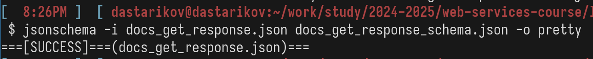

---
## Front matter
title: "Отчет по лабораторной работе №4"
author: "Данила Андреевич Стариков"

## Generic otions
lang: ru-RU
toc-title: "Содержание"


## Pdf output format
toc: true # Table of contents
toc-depth: 2
lof: false # List of figures
lot: false # List of tables
fontsize: 12pt
linestretch: 1.5
papersize: a4
documentclass: scrreprt
## I18n polyglossia
polyglossia-lang:
  name: russian
  options:
	- spelling=modern
	- babelshorthands=true
polyglossia-otherlangs:
  name: english
## I18n babel
babel-lang: russian
babel-otherlangs: english
## Fonts
mainfont: IBM Plex Serif
romanfont: IBM Plex Serif
sansfont: IBM Plex Sans
monofont: IBM Plex Mono
mathfont: STIX Two Math
mainfontoptions: Ligatures=Common,Ligatures=TeX,Scale=0.94
romanfontoptions: Ligatures=Common,Ligatures=TeX,Scale=0.94
sansfontoptions: Ligatures=Common,Ligatures=TeX,Scale=MatchLowercase,Scale=0.94
monofontoptions: Scale=MatchLowercase,Scale=0.94,FakeStretch=0.9
mathfontoptions:
## Biblatex
biblatex: true
biblio-style: "gost-numeric"
biblatexoptions:
  - parentracker=true
  - backend=biber
  - hyperref=auto
  - language=auto
  - autolang=other*
  - citestyle=gost-numeric
## Pandoc-crossref LaTeX customization
figureTitle: "Рис."
tableTitle: "Таблица"
listingTitle: "Листинг"
lofTitle: "Список иллюстраций"
lotTitle: "Список таблиц"
lolTitle: "Листинги"
## Misc options
indent: true
header-includes:

  - \usepackage{indentfirst}
  - \usepackage{float} # keep figures where there are in the text
  - \floatplacement{figure}{H} # keep figures where there are in the text
  - \usepackage{fvextra}
  - \DefineVerbatimEnvironment{Highlighting}{Verbatim}{breaklines,commandchars=\\\{\},breaknonspaceingroup,breakanywhere}
---

# Цель работы

Составить JSON схему, описывающую все возможности метода из лабораторной работы №3 (WEB API Вконтакте). JSON схема должна быть составлена и для объекта, который посылается в запросе и для объекта, который приходит в ответе от сервера. Проверить правильность схемы проверьте с помощью валидатора, например [](jsonschemavalidator.bnet).

# Выполнение лабораторной работы
	
Будем составлять JSON схему для метода `docs.get`. Сначала покажем пример работы этого метода:


```bash
http POST https://api.vk.com/method/docs.get \
access_token==vk1.a.ZdjvFQIhBuM-HEhyBotNorKjYeu_rjgevnostJtKePu5UuGLz4z8mzOO6GKmrm_Kk-eA5E8qsKjJbANnt2XU6_N-Zh5uNZGjHndgbdN_IftuPuxau-Byr_jPx9zB5ZO2vXzvTVx27wt5Eg-Da8YH4ZliMHBIOppoSeF2oBd4QedWd0HJ-tBeBRESAQKW22AfdjF1d8kbzaoB2q-CW9Kgeg \
v==5.199 \
count==5
```

Ответ:

```json
{
    "response": {
        "count": 329,
        "items": [
            {
                "can_manage": true,
                "date": 1702456522,
                "ext": "pdf",
                "id": 670812375,
                "is_unsafe": 0,
                "owner_id": 85081472,
                "size": 1903102,
                "title": "Гамильтоновы циклы .pdf",
                "type": 1,
                "url": "https://vk.com/doc85081472_670812375?hash=hS4lZ4ZBWw7Ncbz4ilLTZB2lxIBMZNiSH6UGrONxbGz&dl=a7TsTAQKlhEKhDKYG7HHXzN9pGAKvWoIdJKpVR8VtUX&api=1&no_preview=1"
            },
            {
                "can_manage": true,
                "date": 1678000031,
                "ext": "pdf",
                "id": 657272932,
                "is_unsafe": 0,
                "owner_id": 85081472,
                "size": 2152747,
                "title": "Домашнее задание 3.pdf",
                "type": 1,
                "url": "https://vk.com/doc85081472_657272932?hash=dqvgB5Xq26A98155W9ThY3DTJTqXmrLviQsjnoZpfq8&dl=c1CYKNAZ7sjXYzQWuoO3Fbrcdkgm4vsndPhQuKbsJ30&api=1&no_preview=1"
            },
            {
                "can_manage": true,
                "date": 1672062726,
                "ext": "pdf",
                "id": 653151850,
                "is_unsafe": 0,
                "owner_id": 85081472,
                "size": 4117280,
                "title": "Подготовка к зачету_221226_144325.pdf",
                "type": 1,
                "url": "https://vk.com/doc85081472_653151850?hash=KF5plXD4Gec5C5Xwfcz5zwia0zH5DMUUChWAhHDFxOk&dl=grMOdtdiXgfPJWca8mdDpedQf9CCfs58pbvMk7X4q5o&api=1&no_preview=1"
            },
            {
                "can_manage": true,
                "date": 1671884548,
                "ext": "pdf",
                "id": 653011190,
                "is_unsafe": 0,
                "owner_id": 85081472,
                "size": 2515804,
                "title": "Notes_221224_152122.pdf",
                "type": 1,
                "url": "https://vk.com/doc85081472_653011190?hash=ZuzwpsckqWrEOXipCh2ep0b9lrNjry38pYxBZ2jYriH&dl=qfTk5Mjex9j3tOJYwKCkQOGVtVvZqPN0vMZTFxKFh8P&api=1&no_preview=1"
            },
            {
                "can_manage": true,
                "date": 1671535324,
                "ext": "pdf",
                "id": 652721733,
                "is_unsafe": 0,
                "owner_id": 85081472,
                "size": 8594963,
                "title": "Подготовка к кр_221207_082207.pdf",
                "type": 1,
                "url": "https://vk.com/doc85081472_652721733?hash=Seblnf8He5kCbmEhTGZOj2r51IoGs9mYhIR3UgzRV10&dl=h6LDxvWYnUoogJxsQ3CwF9IqvFgzkKLVX8Q0znhJMz4&api=1&no_preview=1"
            }
        ]
    }
}
```

Теперь запишем JSON схему для запроса к этому методу:

```json
{
	"name": "docs.get",
	"description": "Возвращает расширенную информацию о документах пользователя или сообщества.",
	"access_token_type": [
		"user"
	],
	"parameters": [
		{
			"name": "count",
			"description": "Количество документов, информацию о которых нужно вернуть. По умолчанию: все документы. Максимальное количество документов, которое можно получить: 2000.",
			"type": "integer",
			"maxItems": 2000,
			"minimum": 1
		},
		{
			"name": "offset",
			"description": "Смещение, необходимое для выборки определенного подмножества документов. Максимальное значение: 1999",
			"type": "integer",
			"maxItems": 1999,
			"minimum": 1
		},
		{
			"name": "type",
			"description": "Тип файла. Возможные значения:",
			"type": "integer",
			"minimum": 1,
			"maximum": 8
		},
		{
			"name": "owner_id",
			"description": "Идентификатор пользователя или сообщества, которому принадлежат документы.",
			"type": "integer"
		},
		{
			"name": "return_tags",
			"description": "",
			"type": "integer",
			"minimum": 0,
			"maximum": 1
		},
	],
	"responses": {
		"response": {
			"$ref": "#/docs_get_response"
		}
	}
}
```

Опишем структуру объекта, приходящего в ответ:

\tiny
```json
{
	"docs_get_response": {
		"type": "object",
		"properties": {
	"response": {
	    "type": "object",
	    "properties": {
		"count": {
		    "type": "integer",
		    "description": "Количество элементов в массиве \"items\"",
		    "minimum": 0
		},
		"items": {
		    "type": "array",
		    "description": "Массив объектов файлов",
		    "items": {
			"$ref": "#/definitions/object_file"
		    }
		}
	    }
	}
    },
    "required": [
	"response"
    ],
    "additionalProperties": false
	}
}
```

Запишем JSON схему для объекта файла:

```json
{
	"object_file":{
		"type": "object",
	    "description": "Объект, описывающий файл",
	    "properties": {
		"id": {
		    "type": "integer",
		    "description": "Идентификатор файла"
		},
		"owner_id": {
		    "type": "integer",
		    "description": "Идентификатор пользователя, загрузившего файл"
		},
		"title": {
		    "type": "string",
		    "description": "Название файла"
		},
		"size": {
		    "type": "integer",
		    "description": "Размер файла в байтах"
		},
		"ext": {
		    "type": "string",
		    "description": "Расширение файла"
		},
		"url": {
		    "type": "string",
		    "description": "Адрес файла, по которому его можно загрузить"
		},
		"date": {
		    "type": "integer",
		    "description": "Дата добавления в формате Unixtime"
		},
		"type": {
		    "type": "integer",
		    "description": "Тип файла. Возможные значения:1 — текстовые документы; 2 — архивы; 3 — gif; 4 — изображения; 5 — аудио; 6 — видео; 7 — электронные книги; 8 — неизвестно.",
		    "minimum": 1,
		    "maximum": 8
		},
		"preview": {
		    "type": "object",
		    "description": "Информация для предварительного просмотра файла.",
		    "properties": {
			"photo": {
			    "type": "object",
			    "properties": {
				"sizes": {
				    "type": "array",
				    "items": {
					"type": "object",
					"properties": {
					    "src": {
						"type": "string"
					    },
					    "width": {
						"type": "integer",
						"mininum": 0
					    },
					    "height": {
						"type": "integer",
						"mininum": 0
					    },
					    "type": {
						"enum": ["s", "m", "x", "o", "p", "q", "r", "y", "z", "w"]
					    }
					}
				    }
				}
			    }
			},
			"graffiti": {
			    "type": "object",
			    "properties": {
				"src": {
				    "type": "string"
				},
				"width": {
				    "type": "integer",
				    "minimum": 0
				},
				"height": {
				    "type": "integer",
				    "minimum": 0
				}
			    }
			},
			"audio_message": {
			    "type": "object",
			    "properties": {
				"duration": {
				    "type": "integer"
				},
				"waveform": {
				    "type": "array",
				    "items": {
					"type": "integer"
				    }
				},
				"link_ogg": {
				    "type": "string"
				},
				"link_mp3": {
				    "type": "string"
				}
			    }
			}
		    }
		}
	    }
	}
}
```

Для проверки созданной JSON схемы создали два файла: `docs_get_response_schema.json`, где описана JSON схема, и `docs_get_response.json`, куда записан ответ, пришедший при выполнении следующего запроса:

```bash
http POST https://api.vk.com/method/docs.get \
access_token==vk1.a.OCl64Tbc6nXOzplPxmFW0iK6OHlN08C2QmttWJDBRbUzGn7BIfs6n50Tcp59JvBtsGNKLGv4z1hWXX8NUgEwQ6p9Vt7UIu6p4LjOx561kybTwVXPMuFjtHdX6Is_EiqBZB1Z8tdfFns8TKix0xsvzYDyamJWVSeWLyOsqWvQ9cN59H5V6hbQ7Ktp1UYev5FY6X-60XLwjV1qi7sF0HwJYw \
count==25 \
v==5.199 \
-o docs_get_response.json
```

Далее с помощью пакета [jsonschema](https://pypi.org/project/jsonschema/) в командной строке запустили проверку:

```bash
jsonschema -i docs_get_response.json docs_get_response_schema.json -o pretty
```



# Выводы

В ходе выполнения лабораторной работы разработали JSON схему по стандарту JSON Schema на основе метода `docs.get` API Вконтакте.
